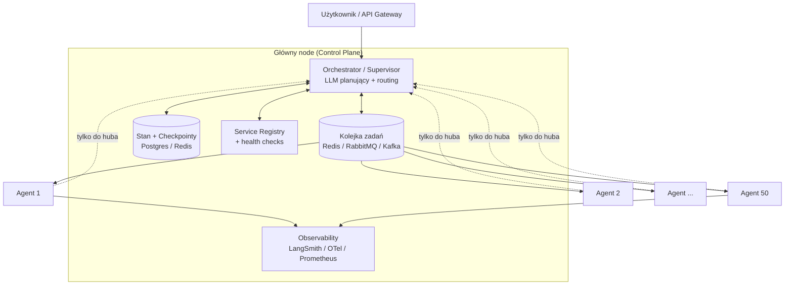
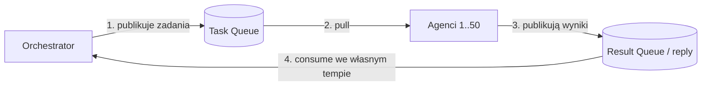
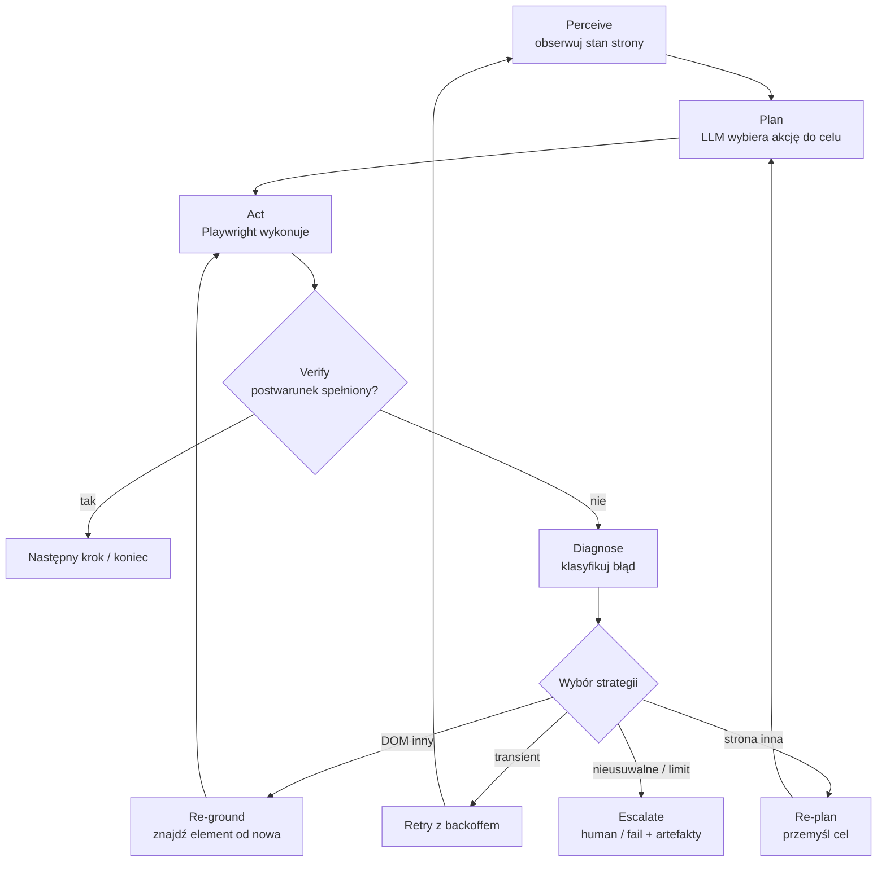

# Architektura systemu agentowego na 50 serwerach (komunikacja tylko z głównym nodem)

## O co właściwie pyta rekruter

Pytanie w wersji oryginalnej brzmi mniej więcej tak:

> „Scenariusz: 50 serwerów. Jakich technologii i architektury użyłbyś w systemie
> agentowym z 50 serwerami, w którym agenci komunikują się jedynie z głównym nodem?"

To jest klasyczne pytanie typu **system design pod agenty**. Pod warstwą buzzwordów
kryje się bardzo konkretny, dobrze znany wzorzec: **topologia gwiazdy (hub-and-spoke /
star topology)**, w której wiele węzłów roboczych rozmawia wyłącznie z jednym węzłem
centralnym, a nigdy bezpośrednio ze sobą. To samo, co w LangGraph nazywa się
**Supervisor**, w systemach rozproszonych **master–worker / coordinator–worker**, a w
Ray **head node + worker nodes**.

Najlepsza odpowiedź na rozmowie zaczyna się od **dopytania, a nie od wyrzucenia z
siebie listy technologii**. Pokazujesz wtedy, że myślisz architektonicznie i nie
projektujesz w próżni.

---

## ⚠️ Co w tym pytaniu nie ma sensu / jest nieprecyzyjne

Pytanie jest celowo (albo przypadkowo) niedoprecyzowane. Warto to **głośno nazwać** —
to jest punktowane wyżej niż udawanie, że wszystko jest jasne. Brakuje odpowiedzi na
kilka pytań, a od nich zależy cała architektura:

1. **Czym jest „serwer" i czym jest „agent"?**
   To najważniejsza niejednoznaczność. Trzeba rozdzielić dwie warstwy, które pytanie
   skleja w jedno:
   - **Warstwa infrastruktury** — 50 fizycznych/wirtualnych maszyn (compute).
   - **Warstwa logiczna** — agenci LLM (role, prompty, narzędzia).

   Czy „50 serwerów" oznacza **50 agentów** (1 agent = 1 maszyna), czy **50 maszyn, na
   których działa N agentów**? To zupełnie inne problemy. Domyślam się, że chodzi o
   „50 węzłów roboczych = 50 agentów", ale to założenie trzeba postawić jawnie.

2. **Co to jest „komunikują się jedynie z głównym nodem"?**
   To jest **ograniczenie projektowe (constraint)**, nie cel. Może oznaczać:
   - Topologię gwiazdy z założenia (orchestrator-centric, jak Supervisor w LangGraph).
   - Wymóg bezpieczeństwa/sieci (workery w prywatnej podsieci, tylko hub ma wyjście
     na świat / klucze do LLM).
   - Po prostu brak komunikacji peer-to-peer między agentami.

   Każda z tych interpretacji prowadzi do innych decyzji.

3. **Czy „główny node" to pojedynczy proces, czy logiczna rola?**
   Jeśli rozumiemy go dosłownie jako jedną maszynę, to jest **pojedynczy punkt awarii
   (SPoF)** i wąskie gardło dla 50 workerów. Dobra odpowiedź musi to zaadresować
   (HA / replikacja / kolejka), bo inaczej cała architektura przewraca się przy
   pierwszym restarcie huba.

4. **Czy to jest system LLM-owy, czy „agent" w sensie rozproszonym?**
   „System agentowy" w 2024–2026 prawie zawsze znaczy agentów LLM. Ale „50 serwerów +
   główny node" brzmi też jak klasyczny **distributed computing / orchestration**
   (np. agent monitorujący na każdym serwerze, raportujący do centrali — jak Prometheus,
   Nomad, Salt, czy fleet management). Warto zapytać, **czy agenci są napędzani LLM**,
   bo to zmienia stack z „LangGraph + kolejka" na „gRPC + agent na każdym hoście".

5. **Jaka jest charakterystyka obciążenia?**
   Brakuje: czy to długie zadania batchowe czy strumień requestów real-time? Czy stan
   ma być trwały między sesjami? Jaki SLA, jaki throughput? Bez tego dobór kolejki,
   persistence i modelu skalowania jest zgadywaniem.

**Krótko na rozmowie:** *„Zanim odpowiem — chcę rozdzielić dwie rzeczy: 50 maszyn jako
infrastrukturę i agentów jako warstwę logiczną. Założę, że mamy topologię gwiazdy:
workery-agenci rozmawiają tylko z koordynatorem, nigdy między sobą. I od razu flaguję,
że 'jeden główny node' to potencjalny single point of failure — wrócę do tego."*

---

## Dwie interpretacje i dwie odpowiedzi

Najlepiej pokazać, że umiesz odpowiedzieć w obu ramach. Na rozmowie wybierasz jedną
(zwykle A, bo „system agentowy" sugeruje LLM), ale wspominasz, że dopytałbyś.

### Interpretacja A — system wieloagentowy oparty na LLM (najbardziej prawdopodobna)

50 agentów LLM o różnych rolach (albo 50 instancji tej samej roli dla równoległości),
koordynowanych przez centralny **orchestrator / supervisor**. Agenci nie gadają ze sobą —
supervisor deleguje zadania, zbiera wyniki, decyduje o kolejnym kroku.

To jest dokładnie wzorzec **Supervisor / hierarchiczny** opisany w
[Multi-Agent Supervisor LangGraph](multi-agent-supervisor-langgraph.md) i
[Wzorce projektowe systemów agentowych](wzorce-projektowe-systemow-agentowych.md).

### Interpretacja B — flota rozproszona (agent jako proces na każdym serwerze)

Na każdym z 50 serwerów działa lekki agent (worker/daemon), który wykonuje zadania
lokalnie i raportuje wyłącznie do centralnego koordynatora. Klasyczny **master–worker**
z fleet managementu. Tu LLM może w ogóle nie być, albo LLM siedzi tylko w centrali jako
„mózg" planujący, a agenci na serwerach są wykonawcami (tool runners).

---

## Architektura (Interpretacja A — wariant główny)



Kluczowa zasada: **agenci nie mają krawędzi między sobą**. Cała komunikacja przechodzi
przez hub (bezpośrednio albo — lepiej — przez kolejkę, która huba odciąża).

### Komponenty głównego node'a (control plane)

| Komponent | Rola | Technologie |
|-----------|------|-------------|
| **Orchestrator / Supervisor** | Planuje, routuje zadania, agreguje wyniki | LangGraph (Supervisor), CrewAI, AutoGen, albo własny FSM |
| **Kolejka / message broker** | Rozdziela pracę, buforuje, odciąża huba | Redis Streams, RabbitMQ, Kafka (przy dużym throughput), NATS |
| **Stan + persistence** | Wspólny stan, checkpointy, wznawianie | PostgreSQL, Redis; w LangGraph: [checkpointer](persistence-sqlite-postgres-langgraph.md) |
| **Service registry + health** | Kto żyje, kto przyjmuje zadania | Consul, etcd, albo heartbeat w Redis |
| **Observability** | Tracing, metryki, koszty tokenów | LangSmith, OpenTelemetry, Prometheus + Grafana |

### Warstwa workerów (50 agentów)

- Każdy agent to proces/kontener: model LLM (API lub self-hosted) + zestaw narzędzi
  ([tool use](narzedzia-dla-agentow-tool-use-langgraph.md)) + prompt systemowy.
- **Pull, nie push** — agent sam pobiera zadanie z kolejki, gdy jest wolny. Hub nie
  musi wiedzieć, kto jest zajęty; to naturalnie load-balansuje i znosi presję ze
  zliczania zajętości na hubie.
- Agent zwraca **ustrukturyzowany wynik** (status + dane + confidence + błędy), nie
  surowy tekst — patrz [obsługa błędów w systemie wieloagentowym](obsluga-bledow-system-wieloagentowy.md).

### Komunikacja hub ↔ agent

- **gRPC / REST** dla synchronicznych wywołań, ale przy 50 workerach lepszy jest
  **broker** (asynchronicznie), żeby hub nie był wąskim gardłem ani SPoF dla każdego
  pojedynczego requestu.
- Format kontraktu: Protobuf (gRPC) albo Pydantic/JSON Schema — z walidacją na granicy.
- mTLS między workerami a hubem, jeśli „komunikacja tylko z hubem" wynika z wymogu
  bezpieczeństwa.

---

## Dlaczego topologia gwiazdy (i jej koszt)

**Zalety:**
- Prostota: O(N) połączeń zamiast O(N²) przy mesh peer-to-peer.
- Centralny punkt kontroli, audytu, governance i kosztów tokenów.
- Łatwy routing, łatwa obserwowalność, jeden punkt egzekwowania polityk i guardraili.
- Workery mogą siedzieć w prywatnej sieci — tylko hub ma klucze do LLM i wyjście na świat.

**Wady (musisz je nazwać sam, zanim zrobi to rekruter):**
- **Single Point of Failure** — pada hub, pada cały system.
- **Wąskie gardło** — 50 workerów dobijających się do jednego procesu.
- **Brak współpracy peer-to-peer** — agenci nie mogą negocjować bezpośrednio (czasem to
  zaleta: pełna kontrola, czasem wada: większe opóźnienie przy zależnych zadaniach).

---

## Jak ratować „jeden główny node" (kluczowy follow-up)

To jest pytanie, które prawie na pewno padnie po Twojej odpowiedzi. Przygotuj je z góry:

1. **Hub bezstanowy + stan w zewnętrznej bazie.** Logika orchestratora nie trzyma stanu
   w pamięci — wszystko w Postgres/Redis. Wtedy hub można replikować.
2. **High Availability huba** — 2–3 repliki za load balancerem, leader election
   (Raft/etcd/Consul), failover. „Jeden główny node" staje się **logiczną rolą**, a nie
   pojedynczą maszyną.
3. **Kolejka jako bufor** — jeśli hub na chwilę padnie, zadania czekają w brokerze i nie
   giną; po restarcie wznawiasz z checkpointu.
4. **Idempotentność i checkpointy** — wznawianie pracy bez duplikowania efektów ubocznych
   (patrz sekcja o idempotentności w [obsłudze błędów](obsluga-bledow-system-wieloagentowy.md)).

Puenta: *„'Główny node' traktuję jako warstwę logiczną (control plane), nie jako jedną
maszynę. Stan wynoszę na zewnątrz, hub replikuję, a kolejka chroni przed utratą zadań —
ograniczenie 'agenci tylko z hubem' zostaje spełnione, a SPoF znika."*

---

## Konkretny stack (gdybym musiał wybrać dziś)

- **Orkiestracja agentów:** LangGraph (Supervisor) — bo daje stan, checkpointy,
  [streaming](streaming-langgraph.md), [human-in-the-loop](human-in-the-loop-interrupt-langgraph.md)
  i [fan-out/fan-in](rownolegle-wezly-fan-out-fan-in-langgraph.md) z pudełka.
- **Skalowanie compute na 50 maszyn:** Ray (head node + workers idealnie mapuje się na
  „hub + 50 agentów") albo Kubernetes (Deployment workerów + HPA, hub jako StatefulSet/HA).
- **Broker:** Redis Streams na start; Kafka, jeśli throughput i trwałość są krytyczne.
- **Stan/persistence:** PostgreSQL (checkpointer LangGraph) + Redis (kolejka, cache, heartbeat).
- **Komunikacja:** gRPC (Protobuf) hub ↔ worker, mTLS.
- **LLM:** API (Claude/OpenAI) dla jakości, albo self-hosted (vLLM) na workerach, jeśli
  liczy się koszt/prywatność i mamy GPU na serwerach.
- **Observability:** LangSmith (tracing agentów) + OpenTelemetry + Prometheus/Grafana.
- **Deployment:** Kubernetes + Helm, autoscaling workerów, hub w trybie HA.

---

## Czego pilnować (production thinking — to zbiera punkty)

- **Backpressure i rate limiting** — 50 agentów potrafi zatkać LLM API (`429`). Globalny
  limiter / token bucket na hubie, nie lokalny retry w każdym workerze (inaczej retry storm).
- **Koszty tokenów** — 50 równoległych agentów to realny budżet; monitoring kosztu per
  zadanie i per agent.
- **Obsługa błędów i częściowe wyniki** — jeden padnięty agent nie może wywrócić całego
  fan-in; reducer wykrywa konflikty i braki.
- **Bezpieczeństwo** — workery w prywatnej podsieci, sekrety w secret managerze (nie w
  kodzie/promptach), mTLS, least privilege na narzędziach.
- **Skalowanie elastyczne** — „50" to nie magiczna liczba; architektura ma działać dla 5
  i dla 500 (autoscaling na podstawie głębokości kolejki).

---

## Ściąga: jak poprowadzić odpowiedź na rozmowie

1. **Dopytaj / postaw założenia** — rozdziel infrastrukturę (50 maszyn) od logiki
   (agenci); nazwij, że „główny node" to topologia gwiazdy i potencjalny SPoF.
2. **Nazwij wzorzec** — hub-and-spoke / Supervisor / master–worker.
3. **Narysuj control plane vs workery** — orchestrator, kolejka, stan, registry, observability.
4. **Wyjaśnij komunikację** — pull z kolejki, ustrukturyzowane wyniki, brak peer-to-peer.
5. **Zaadresuj SPoF** — hub bezstanowy + HA + kolejka jako bufor + checkpointy.
6. **Podaj konkretny stack** — LangGraph/Ray/K8s + Redis/Kafka + Postgres + gRPC + LangSmith.
7. **Dorzuć production thinking** — backpressure, koszty, bezpieczeństwo, elastyczne skalowanie.

---

## Deep-dive: pytania doprecyzowujące do wariantu A

Poniżej trzy konkretne pytania, które realnie padają przy tym scenariuszu, z
odpowiedziami na poziomie „rozmowa na AI Engineera".

### 1. Czy agenci odpowiadają bezpośrednio do orchestratora? Jak go nie zatkać? Czy kolejka na odpowiedzi ma sens?

**Krótko: tak, kolejka na odpowiedzi ma sens — i to jest właśnie kluczowa decyzja.**

Naiwna wersja: 50 agentów woła orchestratora synchronicznie (HTTP/gRPC), gdy skończą.
Problem: jeśli kilkanaście agentów skończy w tej samej chwili, hub dostaje burst, a przy
synchronicznym wywołaniu każdy worker **blokuje się**, czekając aż hub przyjmie wynik.
Hub staje się wąskim gardłem i SPoF dla każdego pojedynczego wyniku.

Lepszy wzorzec to **request–reply przez broker (dwie kolejki / dwa kierunki):**



- **Outbound (zadania):** orchestrator wrzuca zadania do kolejki, agenci **pull**ują, gdy
  są wolni. Naturalny load-balancing i backpressure — wolny agent po prostu nie bierze.
- **Inbound (wyniki):** agent **nie woła huba**, tylko **publikuje wynik na kolejkę
  zwrotną**. Orchestrator konsumuje wyniki we własnym tempie (consumer group). Burst 50
  odpowiedzi naraz ląduje w buforze, a nie wali w jeden proces.
- Korelacja przez `correlation_id` / `task_id` — orchestrator wie, do którego kroku
  workflow należy wynik (typowy pattern reply-to + correlation id z RabbitMQ/Redis Streams).

**Jak dodatkowo zmniejszyć ryzyko, że orchestrator nie wyrobi:**

1. **Rozdziel „mózg" od „dyspozytora".** Orchestrator ma dwie funkcje, które warto
   rozdzielić: (a) **planowanie/decyzje** (drogie wywołania LLM) i (b) **routing,
   agregacja, scalanie wyników** (tani, deterministyczny kod). Nie wołaj LLM przy każdej
   przychodzącej odpowiedzi agenta — większość koordynacji to czysta logika. LLM tylko
   gdy trzeba podjąć nietrywialną decyzję. To radykalnie obniża obciążenie huba.
2. **Hub bezstanowy + stan w bazie** → możesz mieć **N replik orchestratora**
   konsumujących tę samą result queue (skalowanie poziome). „Jeden główny node" zostaje
   rolą logiczną, nie procesem.
3. **Inkrementalny fan-in.** Reducer scala wyniki na bieżąco (np. licznik „zebrano 37/50")
   i zapisuje do stanu, zamiast trzymać wszystko w pamięci i czekać na komplet.
   Checkpoint po każdej agregacji → restart huba nie gubi postępu.
4. **Backpressure i limity.** Ograniczaj równoległość (ile zadań „in-flight"), żeby nie
   zalać ani LLM API (`429`), ani samego huba. Głębokość kolejki = sygnał do autoscalingu
   workerów.
5. **Idempotentność wyników.** Wynik z `task_id` może przyjść dwa razy (retry, redeliver
   z brokera). Orchestrator musi go deduplikować, żeby nie policzyć podwójnie.

Puenta na rozmowę: *„Wyniki idą przez kolejkę zwrotną, nie synchronicznym callem do huba.
Hub konsumuje je we własnym tempie, jest bezstanowy i replikowalny, a ciężką pracę
decyzyjną (LLM) oddzielam od taniej koordynacji. Dzięki temu burst 50 odpowiedzi to
kwestia głębokości kolejki, a nie awarii."*

### 2. HTTP czy gRPC w komunikacji?

To zależy, **który kanał** masz na myśli — a na rozmowie warto to rozbić:

- **Dystrybucja zadań i odbiór wyników (hot path, masowa):** ani „czyste" HTTP, ani gRPC
  — tu rządzi **broker** (Redis Streams / RabbitMQ / Kafka). Transportem jest protokół
  brokera (AMQP / RESP / protokół Kafki), bo daje buforowanie, retry, trwałość i
  backpressure, których goły request/response nie zapewnia. To jest właściwa odpowiedź
  dla wariantu A przy 50 workerach.

- **Control plane / RPC punktowe** (health check, cancel zadania, „pokaż status",
  streaming postępu agenta): tu wybierasz między HTTP a gRPC:

  | Kryterium | gRPC | HTTP/REST |
  |-----------|------|-----------|
  | Latencja, multipleksowanie (HTTP/2) | ✅ niższa | ⚪ wyższa |
  | Kontrakty (Protobuf, codegen, typy) | ✅ silne | ⚪ luźne (OpenAPI) |
  | **Streaming** (token-by-token, progres) | ✅ server/bi-di streaming | ⚪ trzeba SSE/WebSocket |
  | Debugowalność (curl, przeglądarka) | ⚪ trudniej | ✅ trywialna |
  | Komunikacja service-to-service wewnątrz klastra | ✅ idealna | ⚪ OK |

  **Rekomendacja:** **gRPC** do wewnętrznej komunikacji hub ↔ worker, jeśli zależy Ci na
  niskiej latencji, mocnych kontraktach i streamingu (np. agent streamuje postęp/tokeny do
  huba — gRPC server streaming pasuje tu lepiej niż REST). **HTTP/REST** zostaw na
  zewnętrzną krawędź (API Gateway → orchestrator), bo jest prostsze i debugowalne.

- **Do użytkownika końcowego** (streaming odpowiedzi): SSE albo WebSocket, nie gRPC —
  patrz [streaming w LangGraph](streaming-langgraph.md).

Czyli typowy układ: **REST na krawędzi → broker do dystrybucji pracy i wyników → gRPC do
punktowych RPC i streamingu wewnątrz klastra.** Plus mTLS na połączeniach wewnętrznych,
jeśli „komunikacja tylko z hubem" wynika z wymogu sieciowego/bezpieczeństwa.

### 3. Czy każdy agent ma swój LLM, czy współdzielą? Czy dzielą go z orchestratorem?

Najpierw rozdziel dwa znaczenia słowa „LLM", bo to źródło nieporozumień:

- **Warstwa serwowania modelu** (gdzie fizycznie liczą się wagi): endpoint API
  (Claude/OpenAI) albo własny serwer inferencji (vLLM/TGI na GPU).
- **Agent jako rola** (prompt systemowy + kontekst + narzędzia). To jest warstwa logiczna,
  niezależna od tego, gdzie liczy się model.

Model LLM jest **bezstanowy** — stan rozmowy/zadania trzyma agent i orchestrator w swoim
state store, nie „w modelu". Dlatego 50 agentów może spokojnie współdzielić jeden endpoint:
każdy wysyła **swój** prompt i kontekst, dostaje **swoją** odpowiedź. „Własny LLM na agenta"
ma sens praktycznie tylko wtedy, gdy role wymagają **różnych modeli** (fine-tune, model
wyspecjalizowany, izolacja danych), a nie domyślnie.

**Trzy realne warianty:**

| Wariant | Kiedy | Koszt / uwagi |
|---------|-------|---------------|
| **Wspólny endpoint dla wszystkich** (API lub jeden klaster vLLM) | Domyślny wybór; agenci różnią się promptem, nie modelem | Najtaniej, najprościej skalować; trzeba pilnować rate limitów |
| **Model routing / kaskadowanie tierów** | Gdy zależności jakość vs koszt | Orchestrator: mocny model (planowanie, reasoning); workery: tańszy/mniejszy (wykonanie). Patrz [model routing](wyjasnij-teraz-model-routing-kaskadowanie-modeli.md) |
| **Dedykowany model per rola** | Tylko gdy role naprawdę wymagają różnych/fine-tuned modeli | Drogo, więcej infry; uzasadnione przy specjalizacji lub izolacji |

**Czy współdzielą z orchestratorem?** Zwykle **nie ten sam tier**, nawet jeśli ten sam
provider. Typowy, sensowny układ to **kaskada**:

- **Orchestrator/Supervisor** → silniejszy, droższy model (Opus/GPT-tier) do planowania,
  routingu i arbitrażu — bo tu jakość decyzji jest najważniejsza, a wywołań jest mało.
- **Agenci-workery** → tańszy, szybszy model (Haiku/Sonnet-tier) do wykonania zadań — bo
  tu liczy się przepustowość i koszt przy 50 równoległych wywołaniach.

To jest dokładnie idea **model routingu / kaskadowania** i jednocześnie świetna odpowiedź
na koszt: nie palisz topowego modelu na 50 workerach. Patrz
[model routing i kaskadowanie](wyjasnij-teraz-model-routing-kaskadowanie-modeli.md).

Puenta: *„Agenci współdzielą warstwę serwowania (jeden endpoint/klaster), bo model jest
bezstanowy — różni ich prompt i kontekst, nie infrastruktura. Orchestrator zwykle używa
mocniejszego modelu niż workery (kaskada): drogi reasoning w centrali, tani throughput na
brzegach. Dedykowany model na agenta tylko gdy rola wymaga innego/fine-tuned modelu."*

### 4. Czym obsłużyć kolejkę biznesową (task queue + result queue) — Kafka, RabbitMQ czy ActiveMQ?

Najpierw doprecyzowanie: mamy **dwie kolejki** w jednym brokerze — **task queue** (hub →
agenci) i **result queue** (agenci → hub). Obie mają ten sam profil ruchu: **zadania, które
nie mogą zginąć, wymagają trwałości i potwierdzeń (ack)**, a nie ulotnej telemetrii. To jest
kluczowe kryterium wyboru.

Najważniejsze rozróżnienie, które warto powiedzieć na rozmowie: **broker kolejkowy (smart
broker) vs log zdarzeń (dumb broker, smart consumer).** RabbitMQ/ActiveMQ to to pierwsze,
Kafka to drugie — i to determinuje wybór.

| Cecha | **RabbitMQ** | **Kafka** | **ActiveMQ** |
|------|--------------|-----------|--------------|
| Model | Smart broker, kolejka + routing | Rozproszony **log** (partycje, offsety) | Klasyczny broker JMS |
| Naturalne zadania (work queue) | ✅ idealne — competing consumers, ack, priorytety, DLQ | ⚪ da się, ale to nie jego dom | ✅ OK (JMS) |
| Throughput | wysoki | **bardzo wysoki** (setki tys./s) | średni |
| Routing/priorytety/per-message TTL | ✅ bogaty (exchanges, routing keys) | ⚪ ubogi (klucz partycji) | ✅ dobry |
| Replay / odtwarzanie historii | ⚪ słabe (po skonsumowaniu znika) | ✅ mocne (offsety, retencja) | ⚪ słabe |
| Latencja pojedynczego zadania | **niska** | niska, ale optymalizowany pod batch | niska |
| Ekosystem AI/Python/LangGraph | dojrzały, prosty | dojrzały, cięższy operacyjnie | mniejszy, „enterprise Java"/JMS |

**Rekomendacja dla tego scenariusza: RabbitMQ.** Bo to klasyczna **dystrybucja pracy
(task queue)** z competing consumers, ack-ami, priorytetami i **dead-letter queue** (DLQ) na
zadania, które padły N razy. Dokładnie to, czego potrzebuje hub-and-spoke z 50 workerami:
agent bierze zadanie, potwierdza po wykonaniu, a nieudane lądują w DLQ do triage. Korelacja
request–reply (`correlation_id` + `reply-to`) jest w RabbitMQ wzorcem z podręcznika.

**Kiedy Kafka zamiast RabbitMQ:** gdy realnym wymaganiem jest **bardzo wysoki throughput**,
**trwały log do replay** (chcesz odtworzyć wszystkie zadania/wyniki po awarii albo zasilić
nimi analitykę/audyt/event sourcing) albo gdy ta sama strumień zdarzeń ma wielu niezależnych
konsumentów. Cena: Kafka to nie jest „kolejka zadań" — brak natywnych priorytetów, słabsze
per-message ack, cięższa operacyjnie (ZooKeeper/KRaft, partycjonowanie). Dla 50 agentów to
zwykle **przerost formy**, chyba że log/replay/audyt są twardym wymogiem.

**ActiveMQ** wybierasz głównie, gdy jesteś **w ekosystemie Java/JMS** i potrzebujesz zgodności
ze standardem JMS (albo ActiveMQ Artemis pod wyższy throughput). Dla świeżego systemu
agentowego w Pythonie rzadko jest pierwszym wyborem — RabbitMQ daje to samo prościej.

**Uwaga dla skali „tylko" 50 agentów:** często wystarczą **Redis Streams** (consumer groups,
ack, lekkie) — szczególnie jeśli i tak masz Redis na stan/heartbeaty. To najtańszy start;
do RabbitMQ/Kafki przechodzisz, gdy potrzebujesz bogatszego routingu (Rabbit) albo
trwałego logu i replay (Kafka). Nie przeskalowuj brokera „na zapas".

Puenta: *„Obie kolejki to dystrybucja pracy z wymogiem trwałości i ack, nie telemetria —
więc domyślnie RabbitMQ: competing consumers, priorytety, DLQ, wzorzec request–reply z
correlation_id. Kafkę biorę tylko, gdy realnie potrzebuję bardzo wysokiego throughputu albo
trwałego logu do replay/audytu — bo to log zdarzeń, nie kolejka zadań, i operacyjnie cięższy.
ActiveMQ tylko w świecie Java/JMS. Przy samych 50 agentach często wystarczy Redis Streams i
nie przeskalowuję brokera na zapas."*

#### Jak RabbitMQ faktycznie rozdziela taski między agentów (push vs pull, prefetch, ack)

Bardzo dobre pytanie, bo intuicja „ten, który pierwszy zapyta, czy coś jest" opisuje
**model pull (polling)** — a RabbitMQ idiomatycznie działa **odwrotnie: push**. Rozbijmy to.

**Dwa modele dostarczania w RabbitMQ:**

- **Pull (`basic.get`)** — konsument *odpytuje* kolejkę „masz coś?" i dostaje jedną
  wiadomość albo „pusto". To jest dokładnie Twoja intuicja „kto pierwszy zapyta". **Działa,
  ale jest odradzane** — to polling: marnuje round-tripy, gorzej skaluje, wprowadza opóźnienie.
  Używa się go wyjątkowo (np. jednorazowy odczyt), nie do floty workerów.
- **Push (`basic.consume`)** — konsument **subskrybuje kolejkę raz** (rejestruje się jako
  consumer) i utrzymuje otwarte połączenie. To **broker sam wypycha** wiadomości do
  podłączonych konsumentów, gdy tylko się pojawią. **To jest właściwy model dla 50 agentów.**

Czyli nie jest tak, że agent co chwilę pyta „czy coś nowego?". Agent **raz się zapisuje**, a
potem RabbitMQ aktywnie dostarcza mu zadania.

**Competing consumers — wielu agentów na JEDNEJ kolejce.**
Wszystkie 50 agentów subskrybuje **tę samą** kolejkę zadań. RabbitMQ traktuje ich jako
„competing consumers" i **rozdziela** między nich wiadomości. Domyślnie robi to **round-robin**
— wiadomość 1 do agenta A, 2 do B, 3 do C, itd.

**Problem domyślnego round-robin:** jest „głupi" — rozdaje po kolei, **nie patrząc, czy
agent jest zajęty**. Jeśli agent A dostał ciężki task na 30 s, a round-robin i tak wrzuci mu
kolejne wiadomości do bufora, podczas gdy wolny agent B się nudzi. Przy agentach LLM (zadania
bardzo różnej długości) to realny problem.

**Rozwiązanie: prefetch (`basic.qos`, `prefetch_count=1`) — „fair dispatch".**
Ustawiasz, że broker **nie wyśle agentowi kolejnej wiadomości, dopóki ten nie potwierdzi
(ack) bieżącej**. Efekt: agent zajęty nie dostaje nic nowego, a **następne zadanie trafia do
pierwszego wolnego agenta**. To właśnie daje zachowanie bliskie Twojej intuicji „wolny bierze
następne" — ale realizuje to **broker przez kontrolę prefetch**, nie agent przez polling.

```python
# każdy agent przy starcie:
channel.basic_qos(prefetch_count=1)            # nie pakuj mi kolejnych, aż potwierdzę
channel.basic_consume(queue="tasks",           # subskrypcja (push), nie polling
                      on_message_callback=handle,
                      auto_ack=False)            # ack ręczny dopiero po wykonaniu

def handle(ch, method, props, body):
    do_work(body)                               # wykonaj zadanie
    ch.basic_ack(method.delivery_tag)           # dopiero teraz "gotów na następne"
```

**Ack i niezawodność — co, gdy agent padnie.**
Z ręcznym ack (`auto_ack=False`) wiadomość jest „unacked", dopóki agent nie potwierdzi
wykonania. Jeśli agent **padnie** w trakcie (zerwie się połączenie), RabbitMQ uzna, że
zadanie nie zostało wykonane, i **automatycznie je requeue'uje** — trafi do innego, żywego
agenta. To jest mechanizm odporności: padnięty worker nie gubi zadania. (Uwaga: stąd wymóg
**idempotentności** — zadanie może zostać dostarczone ponownie, więc wykonanie nie może
duplikować efektów ubocznych.)

**Pułapka `auto_ack=True`:** wtedy broker uznaje wiadomość za dostarczoną od razu przy
wysłaniu. Jeśli agent padnie przed wykonaniem — zadanie **przepada**. Dla kolejki biznesowej
prawie zawsze chcesz ręczny ack.

**Złożenie w całość — przepływ jednego taska:**

```text
hub publikuje task → exchange → kolejka "tasks"
   → RabbitMQ wypycha (push) do wolnego agenta (prefetch=1 → tylko gdy nic nie przetwarza)
   → agent wykonuje → basic_ack
   → broker uznaje za zrobione i może wysłać mu następny
   (agent padł bez ack? → requeue → inny agent dostaje task)
```

Puenta: *„Nie jest tak, że agent odpytuje kolejkę — to byłby pull/polling, odradzany. Agenci
**subskrybują** jedną kolejkę (push, `basic.consume`) jako competing consumers, a RabbitMQ
sam im wypycha zadania. Domyślny round-robin jest 'głupi', więc ustawiam `prefetch_count=1` —
broker nie da agentowi kolejnego zadania, póki nie potwierdzi bieżącego, więc następny task
idzie do pierwszego wolnego. Ack robię ręcznie po wykonaniu: jak agent padnie, RabbitMQ
requeue'uje zadanie do innego — dlatego wykonanie musi być idempotentne."*

---

## Deep-dive: jak monitorować status 50 agentów bez obciążania kolejki biznesowej

To kolejne „duże" pytanie. Sedno odpowiedzi to jedno zdanie:
**telemetria nie jeździ tym samym kanałem co praca.** Status, heartbeaty i metryki idą
**osobną płaszczyzną** (control/telemetry plane), a kolejka biznesowa (data plane) wozi
wyłącznie zadania i wyniki. Mieszanie tych dwóch to klasyczny błąd, który zatyka kolejkę
biznesową ruchem kontrolnym i psuje opóźnienia realnej pracy.

### Najpierw: rozdziel trzy różne pytania

„Monitorować status" to w praktyce trzy różne rzeczy, z różnymi mechanizmami:

| Co monitorujesz | Pytanie | Mechanizm | Częstotliwość |
|-----------------|---------|-----------|---------------|
| **Liveness** | Czy agent w ogóle żyje? | Heartbeat z TTL | sekundy |
| **Progress / status zadania** | Co teraz robi i na jakim etapie? | Eventy statusu / tracing | per krok |
| **Metryki agregat** | Throughput, latencja, błędy, koszt tokenów | Scrape metryk + dashboard | 10–30 s |

Mylenie ich prowadzi do złych decyzji — np. odpytywanie 50 agentów „co robisz?" w pętli
(drogie, nie skaluje się), żeby sprawdzić, czy żyją (do czego wystarczy tani heartbeat).

### Dlaczego NIE kolejka biznesowa

- Heartbeat co kilka sekund × 50 agentów to stały szum, który konkuruje o tę samą kolejkę
  co zadania → rośnie opóźnienie realnej pracy i głębokość kolejki kłamie (miesza pracę z
  pingami).
- Telemetria ma inny profil: dużo małych, ulotnych komunikatów, które wolno **zgubić**
  (utrata jednego heartbeatu nic nie znaczy). Zadania biznesowe są odwrotnie — nie wolno
  ich gubić, wymagają trwałości. Inny SLA → inny kanał.
- Mieszanie psuje backpressure: nie odróżnisz „kolejka pełna zadań" od „kolejka pełna pingów".

### Mechanizmy (osobna płaszczyzna)

**1. Heartbeat z TTL — wykrywanie martwych agentów (push, tani).**
Agent co N sekund zapisuje „żyję" do **osobnego, lekkiego magazynu** — np. Redis:

```python
# Agent co ~5 s; klucz sam wygasa, jeśli agent przestanie bić
redis.set(f"hb:agent:{agent_id}", now_iso(), ex=15)
# albo sorted set po timestampie — jeden odczyt daje całą flotę:
redis.zadd("agents:heartbeat", {agent_id: time.time()})
```

Wykrycie padniętych bez odpytywania kogokolwiek — jeden zakres po sorted set:

```python
# agenci, którzy nie bili przez 15 s = uznani za martwych
dead = redis.zrangebyscore("agents:heartbeat", 0, time.time() - 15)
```

To jest **dead man's switch**: nie pytasz „czy żyjesz?", tylko zauważasz brak sygnału.
Redis na heartbeaty powinien być **osobną instancją/bazą** niż broker biznesowy (albo
zupełnie inny kanał), żeby telemetria i praca się nie przeplatały.

#### Kto właściwie czyta te heartbeaty? (są 3 modele)

Częsty punkt zaczepienia: „czyli gdzieś stoi serwis, który ciągle skanuje te wpisy?".
**Niekoniecznie.** Redis sam z siebie nie zaalarmuje, że agent padł — coś musi zauważyć
brak sygnału, ale to „coś" ma trzy bardzo różne implementacje:

**Model 1 — leniwe sprawdzanie (TTL key, zero skanowania).**
Używasz `SET hb:agent:X ... EX 15`. Klucz **sam wygasa** po 15 s. Nikt nie musi nic
skanować w pętli — brak klucza *jest* informacją „martwy". Sprawdzasz go **w momencie, gdy
i tak go potrzebujesz**: zanim orchestrator zrouteuje zadanie do agenta, robi
`EXISTS hb:agent:X`; jak nie ma → nie wysyła tam pracy. Detekcja jest **na żądanie
(on-demand)**, a nie przez ciągły monitoring. Najprostsze i często wystarczające.

```python
# orchestrator tuż przed delegacją — żadnego tła, sprawdzasz gdy potrzebujesz
if not redis.exists(f"hb:agent:{candidate_id}"):
    candidate_id = pick_other_agent()   # ten nie żyje, weź innego
```

**Model 2 — event-driven, Redis sam Cię powiadamia (keyspace notifications).**
Redis ma **keyspace notifications**: gdy klucz wygaśnie, Redis publikuje event na kanał
`__keyevent@0__:expired`. Mały serwis-subskrybent dostaje powiadomienie **w chwili**
wygaśnięcia heartbeatu — bez żadnego pollingu. To najbliższe „push z Redisa".

```python
# wymaga: redis-cli config set notify-keyspace-events Ex
pubsub = redis.pubsub()
pubsub.psubscribe("__keyevent@0__:expired")
for msg in pubsub.listen():
    if msg["data"].startswith("hb:agent:"):
        handle_dead_agent(msg["data"])   # re-routing, alert, restart
```

**Model 3 — aktywny sweeper / reaper (tu faktycznie „stoi serwis").**
Jeśli używasz sorted setu (`ZADD agents:heartbeat`), wpisy **nie wygasają same** — więc
**tak, potrzebujesz czegoś, co cyklicznie robi** `ZRANGEBYSCORE ... 0, now-15` i ogłasza
martwych. To „coś" zwykle **nie jest osobnym, ciężkim serwisem**, tylko **lekkim wątkiem/
zadaniem w tle w control plane** (pętla co kilka sekund w orchestratorze) albo małym
cronem/„reaperem". Dopiero przy dużej skali wydziela się to do dedykowanego mikroserwisu.

```python
# lekka pętla w control plane — nie osobny ciężki serwis
async def reaper():
    while True:
        cutoff = time.time() - 15
        for agent_id in redis.zrangebyscore("agents:heartbeat", 0, cutoff):
            handle_dead_agent(agent_id)
            redis.zrem("agents:heartbeat", agent_id)
        await asyncio.sleep(5)
```

**Który wybrać?**

| Model | Kto „monitoruje" | Kiedy |
|-------|------------------|-------|
| TTL + leniwe `EXISTS` | nikt w tle; sprawdzasz przy routingu | domyślny, najprostszy; gdy i tak pytasz przed delegacją |
| TTL + keyspace notifications | subskrybent eventów (reaguje od razu) | gdy chcesz **natychmiastowej** reakcji na padnięcie |
| Sorted set + reaper | wątek w tle / mały serwis | gdy chcesz jednym odczytem widzieć **całą** flotę / liczyć „ilu żywych" |

W praktyce częsty układ to **hybryda**: TTL keys (leniwe `EXISTS` przy routingu) + jeden
lekki reaper/scrape, który **eksportuje metrykę** „liczba żywych agentów" do Prometheusa, a
Alertmanager woła człowieka, gdy spadnie. Czyli „monitor" to nie zawsze osobny serwis —
często to po prostu mechanika TTL Redisa plus drobny wątek w control plane. Ważne:
gdziekolwiek ten obserwator stoi, należy do **control plane**, nigdy do kolejki biznesowej.

**2. Metryki — pull (scrape), nie push do huba.**
Każdy agent wystawia endpoint `/metrics` (Prometheus), a **Prometheus sam odpytuje**
agentów co 10–30 s. Zaleta modelu pull: hub/orchestrator **nic nie robi** w temacie metryk
— monitoring jest poza ścieżką biznesową i poza hubem. Metryki per agent: liczba zadań,
latencja kroku, błędy, retry, zużycie tokenów/koszt, długość pętli ReAct. Wizualizacja:
Grafana. Alerty: Alertmanager (np. „>20% agentów martwych", „latencja p95 rośnie").

**3. Tracing rozproszony — co dzieje się wewnątrz zadania.**
Do pytania „na jakim etapie jest agent" służy **distributed tracing**, nie kolejka.
OpenTelemetry (trace_id propagowany od zadania przez agenta po narzędzia) + **LangSmith**
do śledzenia przebiegów agentowych (prompt, tokeny, kroki, koszt). Każde zadanie ma
`trace_id` = możesz odtworzyć cały przebieg bez dopytywania agenta na żywo.

**4. Logi strukturalne, centralnie.**
Agenci logują JSON-em (z `agent_id`, `task_id`, `trace_id`) do centralnego zbieracza
(Loki / ELK / OpenSearch), osobnym kanałem. Korelacja z metrykami i trace'ami po `task_id`.

**5. Service registry / membership (opcjonalnie przy większej skali).**
Consul/etcd z TTL trzyma listę żywych agentów i ich „capabilities". Orchestrator routuje
tylko do zarejestrowanych, żywych workerów. Dla 50 agentów wystarczy zwykle Redis z
heartbeatami; registry to wariant na 500+ i dynamiczne dołączanie/odłączanie.

### Status zadań „za darmo" — z tego, co hub już wie

Część statusu masz **bez żadnego dodatkowego ruchu**: orchestrator i tak trzyma w swoim
state store (Postgres/Redis), które zadania są `in-flight`, `done`, `failed` — to wynik
modelu pull-z-kolejki i [checkpointów](persistence-sqlite-postgres-langgraph.md). Status
systemu („37/50 gotowe") czytasz z **bazy stanu, nie z kolejki biznesowej**. Wystaw to
osobnym, **read-only API statusu** (REST/gRPC) — dashboard i ludzie pytają jego, nie ruszając
ścieżki produkcyjnej.

### Wykrywanie „zawieszonych", nie tylko martwych

Agent może żyć (bić heartbeatem), a mimo to **kręcić się w kółko** (pętla ReAct bez
postępu). To nie jest brak liveness — to brak progresu. Wykrywasz to metrykami progresu
(brak zmiany stanu / te same wywołania narzędzi przez K iteracji) — dokładnie reguła
`is_stuck` z [obsługi błędów w systemie wieloagentowym](obsluga-bledow-system-wieloagentowy.md).
Heartbeat mówi „żyję", metryki progresu mówią „ale nic nie robię" — potrzebujesz obu.

### Push vs pull — kiedy co

| | Push (agent wysyła) | Pull (monitoring odpytuje) |
|---|---|---|
| **Heartbeat / liveness** | ✅ naturalny (dead man's switch) | ⚪ 50 zapytań w pętli, gorzej skaluje |
| **Metryki** | ⚪ obciąża odbiorcę przy burstach | ✅ Prometheus scrape, hub nieobciążony |
| **Eventy statusu / postęp** | ✅ push na osobny topic telemetryczny | ⚪ |

Reguła: **liveness i eventy = push** (osobny kanał), **metryki = pull**. W żadnym wypadku
przez kolejkę biznesową.

### Konkretny stack monitoringu

- **Heartbeat:** Redis (osobna instancja/DB) — sorted set z timestampem, TTL.
- **Metryki:** Prometheus (scrape `/metrics`) + Grafana + Alertmanager.
- **Tracing:** OpenTelemetry + LangSmith (przebiegi agentowe, koszt tokenów).
- **Logi:** strukturalny JSON → Loki / ELK, korelacja po `trace_id`/`task_id`.
- **Status zadań:** read-only API czytające state store (Postgres), nie kolejkę.
- **Membership (opcjonalnie):** Consul/etcd z TTL przy dużej, dynamicznej flocie.

Puenta na rozmowę: *„Rozdzielam telemetrię od pracy. Liveness to heartbeat z TTL na osobnym
Redisie (dead man's switch — nie odpytuję 50 agentów). Metryki ciągnie Prometheus modelem
pull, więc hub jest nieobciążony. Postęp śledzę tracingiem (OTel + LangSmith) i metrykami
progresu, a 'zawieszenie' wykrywam brakiem postępu mimo żywego heartbeatu. Status 'ile
gotowe' czytam z bazy stanu osobnym read-only API. Kolejka biznesowa wozi tylko zadania i
wyniki — nigdy pingów."*

---

## Deep-dive: pętla samonaprawcza dla agenta opartego na Playwright

Kolejne „duże" pytanie. Agent sterujący przeglądarką (Playwright) jest wyjątkowo kruchy,
bo świat zewnętrzny (DOM, layout, sieć) zmienia się pod nim bez ostrzeżenia. „Self-healing
loop" to architektura, w której agent **wykrywa, że akcja się nie udała, diagnozuje
dlaczego i adaptuje się** — zamiast wywalać się na pierwszym `selector not found`.

Kluczowa zmiana myślenia: agent nie wykonuje **sztywnego skryptu** („kliknij `#btn-42`"),
tylko realizuje **cel semantyczny** („wyślij formularz"), a konkretny lokator jest
**wyprowadzany na nowo przy każdym kroku** z aktualnego stanu strony. To jest właśnie
„healing": kiedy DOM się zmieni, agent **re-groundu­je** cel, a nie umiera.

### Pętla: Perceive → Plan → Act → Verify → Heal



Najważniejszy jest węzeł **Verify**: agent **nie zakłada**, że `click()` zadziałał.
Sprawdza postwarunek (zmienił się URL? pojawił się element potwierdzenia? zniknął
spinner?). Bez tego self-healing jest niemożliwy, bo nie wiesz, że trzeba leczyć — to
dokładnie problem [silent failure z notatki o obsłudze błędów](obsluga-bledow-system-wieloagentowy.md).

### 1. Perceive — czym agent „widzi" stronę

Trzy modalności, zwykle hybryda:

| Modalność | Zaleta | Koszt / wada |
|-----------|--------|--------------|
| **Accessibility tree** (`page.accessibility.snapshot()`) | Strukturalny, tani, semantyczny (role+nazwy) | Pomija część dynamicznego UI |
| **DOM / zredukowany HTML** | Pełny, precyzyjny | Duży, szumny, drogi w tokenach |
| **Screenshot + model wizyjny** | Odporny na dziwny DOM, widzi to co człowiek | Najdroższy, wolniejszy |

Praktyka: domyślnie **accessibility tree** (tanio, semantycznie), a **screenshot/vision**
dorzucasz jako fallback dopiero, gdy tekstowe re-grounding zawiedzie. Zawsze redukuj
kontekst — nie wrzucaj surowego DOM-u na 200 kB do promptu.

### 2. Lokatory odporne + łańcuch fallbacków (pierwsza linia obrony)

Większość kruchości znika, zanim potrzebujesz LLM, jeśli używasz **odpornych lokatorów**
Playwrighta zamiast kruchego CSS/XPath:

```python
# ŹLE — kruche, pęka przy każdym redesignie
page.click("#app > div.main > form > button:nth-child(3)")

# DOBRZE — semantyczne, odporne (Playwright zaleca tę kolejność)
page.get_by_role("button", name="Wyślij").click()
```

Priorytet: `get_by_role` / `get_by_label` / `get_by_text` / `data-testid` → dopiero na końcu
CSS. Plus **łańcuch fallbacków** — kilka strategii pod jeden cel semantyczny:

```python
async def resolve(page, target: SemanticTarget) -> Locator:
    for strategy in target.locator_chain:          # role → testid → text → css
        loc = strategy(page)
        if await loc.count() == 1:
            return loc
    raise ElementNotResolved(target)               # dopiero teraz wołamy LLM re-ground
```

Korzystaj też z **wbudowanego auto-waitingu** Playwrighta (czeka na widoczność/aktywność
elementu) — **nigdy `sleep()`**. Połowa „flaky" błędów to brak czekania, nie zmiana DOM.

### 3. Act + Verify — kontrakt każdej akcji

Każda akcja powinna mieć **jawny postwarunek**, inaczej nie ma czego leczyć:

```python
@dataclass
class BrowserAction:
    intent: str                       # "wyślij formularz logowania"
    target: SemanticTarget
    op: Literal["click", "fill", "select", "navigate"]
    value: str | None = None
    postcondition: Callable[[Page], Awaitable[bool]]  # np. URL == /dashboard
    idempotency_key: str | None = None  # dla akcji z efektem ubocznym
```

Po wykonaniu sprawdzasz `postcondition`. Jeśli nie przejdzie → wchodzisz w Heal.
Dla akcji z efektem ubocznym (wysłanie formularza, zakup) **idempotency_key** jest
krytyczny — przy retry nie wolno wysłać dwa razy (patrz idempotentność w
[obsłudze błędów](obsluga-bledow-system-wieloagentowy.md)).

### 4. Diagnose — taksonomia błędów przeglądarkowych

Self-healing bez klasyfikacji = ślepe ponawianie. Każdy typ błędu ma inną reakcję:

| Błąd | Typ | Reakcja |
|------|-----|---------|
| Timeout / network glitch | transient | retry z backoffem |
| Element niewidoczny / przykryty | transient/UI | poczekaj, zamknij overlay, scroll, retry |
| Selektor nie znaleziony / stale | **DOM inny** | **re-ground** (LLM/vision znajduje od nowa) |
| Nieoczekiwany modal / cookie / popup | UI | obsłuż znanym handlerem, potem retry |
| Redirect na inną stronę niż oczekiwana | **strona inna** | **re-plan** celu |
| Wylogowanie / wygasła sesja | stan | re-auth, potem wznów z checkpointu |
| Captcha / bot detection | nieusuwalne (zwykle) | **escalate** do human-in-the-loop |
| Te same akcje N razy bez postępu | stagnacja | przerwij pętlę (`is_stuck`) |

Rozróżnienie transient vs permanent oraz wykrywanie stagnacji to ten sam mechanizm, co w
ogólnej [obsłudze błędów agentowych](obsluga-bledow-system-wieloagentowy.md) — tylko z
domeną przeglądarki.

### 5. Heal — re-grounding sterowany LLM (serce samonaprawy)

Gdy łańcuch lokatorów zawiedzie, **nie poddajesz się** — przekazujesz LLM aktualny stan
strony i cel, a model **wskazuje element od nowa**:

```python
async def reground(page, target: SemanticTarget, attempt: int) -> Locator:
    tree = await page.accessibility.snapshot()        # tanio, semantycznie
    obs = reduce_a11y(tree)                            # przytnij szum
    if attempt >= VISION_FALLBACK_AT:                 # eskalacja modalności
        obs = {"a11y": obs, "screenshot": await page.screenshot()}
    # LLM zwraca structured output: jak namierzyć element TERAZ
    spec = await llm.locate(intent=target.intent, observation=obs)
    loc = page.get_by_role(spec.role, name=spec.name) if spec.role else page.locator(spec.css)
    if await loc.count() != 1:
        raise ElementNotResolved(target)              # poddaj się tej iteracji
    return loc
```

To jest różnica między „pękającym skryptem" a „agentem": po redesignie strony skrypt umiera,
a agent ponownie semantycznie odnajduje „przycisk Wyślij", bo opisem celu jest **intencja**,
nie ścieżka w DOM.

### 6. Guardy pętli — żeby self-healing nie stał się self-harmem

Pętla naprawcza bez limitów to nieskończone palenie tokenów i ryzyko zapętlenia:

- **Limit prób per akcja** (np. 3) i **deadline na cały task** (budżet czasu).
- **Wykrywanie stagnacji** (`is_stuck`): te same akcje/błędy bez zmiany stanu → przerwij,
  nie ponawiaj. Komunikat do LLM musi zawierać historię nieudanych prób i **zakaz
  powtarzania** tych samych kroków (inaczej model wzmacnia pętlę).
- **Escalation graf**: transient retry → re-ground → re-plan → human-in-the-loop / fail.
- **Backoff + jitter** dla błędów sieciowych; respektuj rate limiting.

### 7. Obserwowalność i wznawianie (produkcyjnie)

- **Na każdą porażkę zapisuj artefakty:** Playwright **trace** (`tracing.start/stop`),
  screenshot, zrzut DOM/a11y. To bezcenne do debugowania niedeterministycznych awarii i do
  ewaluacji, jak często healing działa.
- **Checkpointuj postęp** kroków, żeby restart nie powtarzał całej sesji
  ([persistence/checkpointer](persistence-sqlite-postgres-langgraph.md)) — z idempotencją
  dla kroków z efektem ubocznym.
- **Mierz skuteczność healingu:** % akcji wymagających re-ground, % udanego re-ground bez
  człowieka, średnia liczba prób, koszt tokenów na zadanie. To metryki jakości, nie tylko
  alerty runtime.
- **Human-in-the-loop** na nieusuwalne przypadki (captcha, dwuznaczny stan, akcja wysokiego
  ryzyka) — interrupt → review → resume, patrz [HITL w LangGraph](human-in-the-loop-interrupt-langgraph.md).

### Jak to wpina się w architekturę 50 agentów

W wariancie A każdy worker-agent przeglądarkowy ma **własną sesję Playwright** (osobny
kontekst/przeglądarka — izolacja stanu, cookies, sesji). Pętla self-healing działa
**lokalnie w workerze**; do orchestratora przez kolejkę zwrotną wraca dopiero
**ustrukturyzowany wynik** (sukces / fail + artefakty + status), a heartbeat leci osobnym
kanałem. Orchestrator nie zajmuje się leczeniem pojedynczego kliknięcia — to
odpowiedzialność workera; hub widzi tylko efekt i ewentualną eskalację.

Puenta na rozmowę: *„Agent realizuje cel semantyczny, nie sztywny skrypt. Po każdej akcji
weryfikuję postwarunek; jak nie przejdzie, klasyfikuję błąd i wybieram reakcję: retry dla
transient, re-ground (LLM odnajduje element od nowa z accessibility tree, vision jako
fallback) dla zmienionego DOM, re-plan dla innej strony, a captcha/akcje ryzykowne eskaluję
do człowieka. Wszystko z limitem prób, wykrywaniem stagnacji, idempotencją akcji i zapisem
trace'u na porażkę. Healing dzieje się w workerze; do huba wraca tylko wynik."*

---

## Jak rozszerzyć flotę 10× (z 50 do 500 agentów)

To jest follow-up, który pada po „a gdyby było ich nie 50, tylko 500?". Cała
architektura z wariantu A jest już pomyślana jako rozszerzalna — kluczowe decyzje
(pull z kolejki, hub bezstanowy, telemetria osobnym kanałem) to nie ozdoby, tylko
właśnie **enablery skalowania**. Poniżej zebrane w jeden playbook to, co w
dokumencie jest rozsiane, plus to, co przy 10× faktycznie trzeba zmienić.

Najpierw zasada przewodnia: **„50" nie jest magiczną liczbą — sygnałem do
skalowania jest głębokość kolejki, nie ręczne dokładanie maszyn.** Skalujesz po
metryce (backlog rośnie → dodaj workerów; backlog pusty → zdejmij), a nie po
przeczuciu.

### Co skaluje się samo, a co trzeba świadomie zmienić

| Wymiar | Przy 50 | Przy 500 (10×) | Czy trzeba coś zmienić? |
|--------|---------|----------------|--------------------------|
| **Warstwa workerów** | 50 procesów/podów | 500 procesów/podów | **Nie** — pull z kolejki + autoscaling. Dokładasz repliki, hub nic nie wie o liczbie. |
| **Hub / orchestrator** | 2–3 repliki HA | N replik konsumujących tę samą result queue | **Tak, ilościowo** — bo bezstanowy, skaluje się poziomo; ale patrz „dyspozytor vs mózg". |
| **Broker** | Redis Streams wystarcza | RabbitMQ / Kafka, często **sharding / partycjonowanie** | **Tak** — jeden węzeł brokera staje się gardłem; partycjonujesz kolejki. |
| **State store** | Postgres + Redis | read-repliki, connection pooling, partycje | **Tak** — 500 workerów × checkpointy to realne obciążenie zapisu. |
| **LLM API** | mieści się w limitach | **twardy sufit** — `429`, quota, koszt | **Tak** — to zwykle realne ograniczenie skali, nie compute. |
| **Telemetria** | jeden Redis na heartbeaty + Prometheus | dedykowany kanał, sampling, registry z TTL | **Tak** — 500 heartbeatów to inny profil; tu wchodzi service registry. |
| **Membership / discovery** | Redis z heartbeatami wystarcza | Consul/etcd z TTL | **Tak** — dokładnie wariant „na 500+" wspomniany w sekcji monitoringu. |

Sedno: **data plane (workery) skaluje się trywialnie, control plane i zależności
zewnętrzne (broker, baza, LLM API) wymagają świadomych decyzji.**

### 1. Autoskalowanie workerów po głębokości kolejki (rdzeń skalowania)

Nie skalujesz po CPU — agent LLM przez większość czasu czeka na I/O (API modelu),
więc CPU kłamie. Skalujesz po **backlogu kolejki na workera**:

```text
desired_workers = ceil(queue_depth / target_backlog_per_worker)
# np. target = 5 zadań w kolejce na workera:
#   2500 zadań w backlogu / 5  → 500 workerów
#    250 zadań w backlogu / 5  →  50 workerów
```

W Kubernetes realizuje to **HPA na metryce custom/external** (głębokość kolejki z
Prometheusa albo KEDA z triggerem na RabbitMQ/Kafka/Redis Streams). W Ray —
autoscaler na podstawie pending tasks. Ważne guardy:

- **min/max repliki** (np. 5–500) — `max` chroni LLM API i budżet przed runaway.
- **scale-up szybki, scale-down powolny** (cooldown / stabilization window) — żeby
  nie „pompować" liczby workerów przy szarpanym ruchu.
- **graceful drain** — worker przed zdjęciem kończy bieżące zadanie i robi `ack`;
  niedokończone wracają do kolejki (requeue), bo wykonanie jest idempotentne.

### 2. Skalowanie huba: rozdziel „dyspozytora" od „mózgu"

Przy 500 workerach jeden orchestrator nie wyrobi, jeśli woła LLM przy każdej
odpowiedzi. Dlatego (rozwinięcie tego, co w deep-dive o niezatykaniu huba):

- **Mózg** (planowanie/decyzje LLM) — wywoływany rzadko, może zostać 1–kilka
  instancji; to nie hot path.
- **Dyspozytor** (routing, agregacja, reducer, dedup wyników) — tani,
  deterministyczny kod; **to** skalujesz poziomo do N replik konsumujących tę samą
  `result queue` przez consumer group. „Jeden główny node" pozostaje **rolą
  logiczną**, a nie procesem — leader election (Raft/etcd/Consul) tylko dla tej
  części, która naprawdę musi być pojedyncza (np. globalne decyzje planistyczne).

### 3. Broker: kiedy jeden węzeł przestaje wystarczać

Progresja ze skalą (rozwinięcie sekcji o wyborze brokera):

- **Redis Streams** — OK na start i często do ~setek workerów, jeśli i tak masz
  Redis; consumer groups dają competing consumers i ack.
- **RabbitMQ** — gdy chcesz bogatszego routingu, priorytetów, DLQ; przy 10×
  rozważ **wiele kolejek shardowanych** (np. po typie zadania albo po kluczu), żeby
  jedna kolejka nie była gardłem, oraz quorum queues dla HA.
- **Kafka** — gdy throughput/replay/audyt są twardym wymogiem; skalujesz przez
  **liczbę partycji** (równoległość konsumpcji = liczba partycji), więc partycjonuj
  z zapasem pod docelowe 500, nie pod startowe 50 (repartycjonowanie jest bolesne).

Reguła: **nie przeskalowuj brokera „na zapas", ale partycjonuj/sharduj, zanim
backlog zacznie rosnąć liniowo z liczbą agentów.**

### 4. LLM API to zwykle prawdziwy sufit (nie compute)

500 agentów bijących w jeden endpoint to natychmiastowe `429`. Compute (K8s/Ray)
dosztukujesz w minutę — **rate limit modelu nie**. Dlatego:

- **Globalny limiter / token bucket na poziomie control plane**, nie lokalny retry
  w każdym workerze (inaczej retry storm 500 agentów dobija API).
- **Kaskada modeli** — drogi reasoning tylko w hubie, tani/szybki model na
  workerach (patrz [model routing i kaskadowanie](wyjasnij-teraz-model-routing-kaskadowanie-modeli.md));
  przy 500 workerach to różnica między rachunkiem do udźwignięcia a nie.
- **Wiele providerów / kluczy / regionów** jako pula przepustowości, jeśli jeden
  limit nie wystarcza; load-balancing zapytań i fallback przy `429`.
- **Backlog kolejki absorbuje burst** — gdy API jest wysycone, zadania czekają w
  brokerze, a głębokość kolejki staje się sygnałem „jesteśmy rate-limited",
  niekoniecznie „dodaj workerów" (dodanie ich nic nie da, jeśli sufit to API).

### 5. Telemetria i membership przy 10× agentów

To, co przy 50 było trywialne, przy 500 robi się osobnym problemem (rozwinięcie
sekcji monitoringu):

- **Heartbeaty** — 500 × co kilka sekund to stały strumień; trzymaj go na
  **osobnej instancji Redis** (nie na brokerze biznesowym) i czytaj flotę jednym
  `ZRANGEBYSCORE`, a nie 500 odpytaniami.
- **Service registry** — przy dynamicznym dołączaniu/odłączaniu setek workerów
  wchodzi **Consul/etcd z TTL** zamiast ręcznego zarządzania listą; orchestrator
  routuje tylko do zarejestrowanych, żywych.
- **Metryki** — Prometheus pull skaluje, ale 500 targetów to już temat na
  **federację / sharding scrape'ów** albo agenta typu OTel collector agregującego
  lokalnie; rozważ sampling tracingu (nie 100% przy 500 agentach).

### Playbook „50 → 500" w pięciu krokach

1. **Workery**: włącz autoscaling po głębokości kolejki (KEDA/HPA/Ray), ustaw
   min/max i graceful drain z requeue. To załatwia ~80% skalowania.
2. **Hub**: oddziel dyspozytora (skaluj poziomo, consumer group na result queue) od
   mózgu (rzadkie wywołania LLM, leader election tylko gdzie konieczne).
3. **Broker**: sharduj/partycjonuj kolejki, włącz HA (quorum queues / replikacja),
   dobierz liczbę partycji pod docelową, nie startową skalę.
4. **Zależności**: globalny rate limiter + kaskada modeli + pula kluczy/providerów;
   read-repliki i pooling dla state store.
5. **Telemetria**: osobny kanał, registry z TTL na membership, federacja/sampling
   metryk i tracingu.

Puenta na rozmowę: *„Architektura jest skalowalna z założenia, bo workery biorą
pracę pullem z kolejki, a hub jest bezstanowy — dlatego skalowanie 10× to przede
wszystkim autoscaling workerów po głębokości kolejki, nie przeprojektowanie. Hub
skaluję poziomo, rozdzielając tani dyspozytor od drogiego mózgu LLM. Realnym
sufitem przy 500 agentach nie jest compute, tylko limity LLM API i broker — więc
globalny rate limiter, kaskada modeli i shardowanie/partycjonowanie kolejek. '50'
to parametr autoscalera, nie stała architektury."*

---

## Powiązane tematy

- [Agentowa platforma AI — automatyzacja QA E2E](agentowa-platforma-ai-automatyzacja-qa-e2e.md)
- [Automatyzacja testów — przygotowanie (rozmowa AI Engineer)](automatyzacja-testow-przygotowanie-rozmowa-ai-engineer.md)
- [Multi-Agent Supervisor LangGraph](multi-agent-supervisor-langgraph.md)
- [Wzorce projektowe systemów agentowych](wzorce-projektowe-systemow-agentowych.md)
- [Orkiestrator vs Planner w architekturze wieloagentowej](orkiestrator-vs-planner-w-architekturze-wieloagentowej.md)
- [Agentic Workflows i Multi-Agent Orchestration](agentic-workflows-multi-agent-orchestration.md)
- [Obsługa błędów w systemie wieloagentowym](obsluga-bledow-system-wieloagentowy.md)
- [Równoległe węzły (Fan-out/Fan-in)](rownolegle-wezly-fan-out-fan-in-langgraph.md)
- [Persistence i checkpointery w LangGraph](persistence-sqlite-postgres-langgraph.md)
- [Human-in-the-Loop w LangGraph](human-in-the-loop-interrupt-langgraph.md)
- [Narzędzia dla agentów (Tool Use)](narzedzia-dla-agentow-tool-use-langgraph.md)
- [Zadanie rekrutacyjne: system wieloagentowy](zadanie-rekrutacyjne-system-wieloagentowy.md)