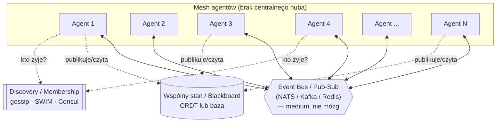
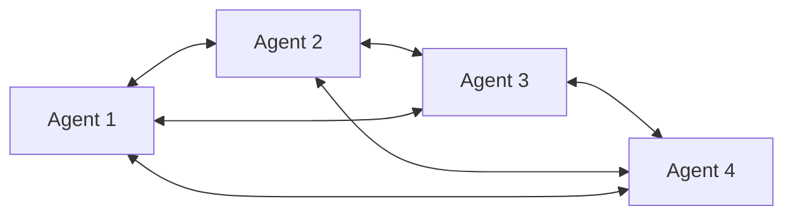
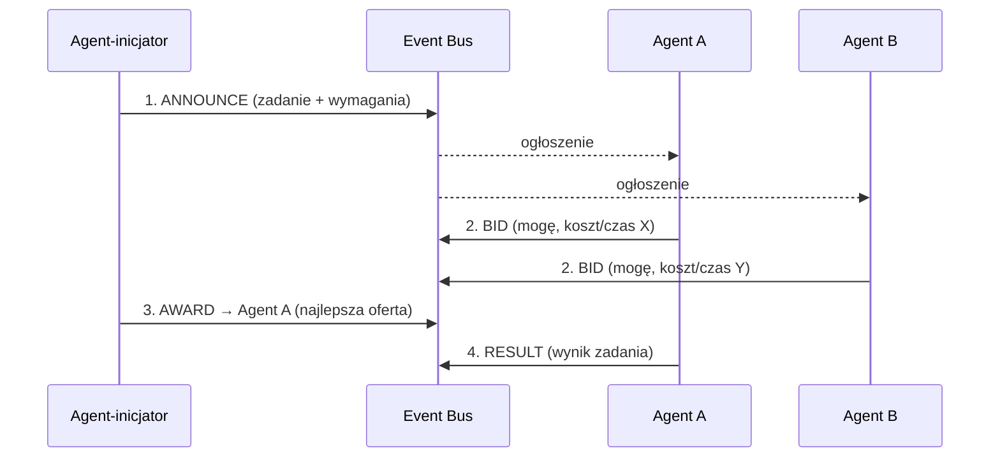

# Architektura systemu agentowego bez centralnego huba (mesh / peer-to-peer)

> Wariant „lustrzany" do architektury [hub-and-spoke z 50 serwerami](architektura-agentowa-50-serwerow-hub-and-spoke.md).
> Tam wszyscy agenci rozmawiali **tylko z głównym nodem** (topologia gwiazdy).
> Tutaj odwracamy założenie: **nie ma centralnego huba — każdy agent może rozmawiać z każdym** (topologia siatki / mesh).

## TL;DR

- Topologia: **full mesh / peer-to-peer** zamiast gwiazdy. Brak pojedynczego orchestratora,
  brak pojedynczego punktu awarii (SPoF) — ale za cenę większej złożoności koordynacji.
- Komunikacja: **event bus / pub-sub + gossip**, a nie „każdy trzyma N-1 połączeń TCP".
  Logiczny mesh nie musi oznaczać fizycznego O(N²) okablowania.
- Koordynacja: zamiast supervisora — **wspólny stan (blackboard / CRDT)**,
  **kontrakty (contract net)** i **konsensus** tam, gdzie potrzeba jednej prawdy.
- Kompromis: zyskujesz odporność i autonomię, tracisz prostotę kontroli, audytu i debugowania.

---

## Czym to się różni od hub-and-spoke (jedno zdanie)

| | Hub-and-spoke (gwiazda) | Mesh (peer-to-peer) |
|---|---|---|
| Kto decyduje | centralny orchestrator/supervisor | każdy agent lokalnie + uzgodnienia |
| Liczba krawędzi | O(N) — wszyscy do huba | logicznie O(N²), fizycznie przez bus |
| SPoF | tak (hub) | brak pojedynczego (rozproszona awaria) |
| Routing | centralny, prosty | rozproszony (gossip / discovery) |
| Audyt / kontrola kosztów | łatwy, w jednym miejscu | trudny, rozproszony |
| Debug / obserwowalność | prosta (jeden punkt) | trudna (trace przez wielu peerów) |
| Skalowanie | wąskim gardłem jest hub | brak centralnego wąskiego gardła |
| Spójność stanu | naturalna (jeden stan) | wymaga CRDT / konsensusu |

Pointa: **mesh kupujesz odpornością i autonomią, płacisz złożonością koordynacji.**
Hub jest prosty i kontrolowalny, ale kruchy w jednym punkcie; mesh jest odporny,
ale „jedna prawda" przestaje być za darmo.

---

## Architektura — wariant główny (logiczny mesh przez event bus)

Najczęstszy błąd przy „każdy z każdym" to wyobrażenie sobie 50 agentów,
z których każdy trzyma 49 bezpośrednich połączeń (2450 krawędzi).
W praktyce **logiczny mesh realizujesz przez wspólny event bus / pub-sub** —
fizycznie każdy agent łączy się z busem, logicznie każdy może dosięgnąć każdego.

Kluczowa zasada (odwrotna niż w gwieździe): **agenci mają krawędzie między sobą** —
publikują zdarzenia, na które reaguje każdy zainteresowany peer. Nie ma węzła,
który „rozdaje pracę". Bus jest **medium komunikacji, nie decydentem** — gdyby był
decydentem, wracalibyśmy do huba.

### Wariant czysto P2P (bez wspólnego busa)

Jeśli ograniczeniem jest „żadnego centralnego komponentu w ogóle" (nawet busa),
agenci komunikują się bezpośrednio, a wiedzę o świecie rozsiewają **gossipem**:

Każdy agent zna część sąsiadów, stan i zadania propagują się **epidemicznie**
(protokoły gossip / SWIM, jak w Cassandrze, Consulu, Serfie). To prawdziwy P2P —
najbardziej odporny, ale najtrudniejszy do uzgodnienia spójności i debugowania.

---

## Trzy problemy, które w gwieździe rozwiązywał hub — i jak je rozwiązać w mesh

Hub dawał za darmo cztery rzeczy: **routing zadań, wspólny stan, wykrywanie kto żyje,
oraz rozwiązywanie konfliktów**. W mesh każdą z nich trzeba zaprojektować osobno.

### 1. Routing zadań — kto bierze które zadanie (Contract Net Protocol)

Bez huba nikt nie „przydziela" pracy. Klasyczne rozwiązanie to **Contract Net Protocol**
(rynek zadań): agent z zadaniem ogłasza przetarg, zdolni agenci licytują, ogłaszający
wybiera wykonawcę.

- **ANNOUNCE → BID → AWARD → RESULT** — zdecentralizowany odpowiednik kolejki zadań.
- Naturalny load-balancing: zajęty agent nie licytuje albo licytuje gorzej.
- Brak centralnego dyspozytora — każdy agent może być inicjatorem dla swoich podzadań.

Alternatywa lżejsza: **pub-sub po typie zadania** (capability-based routing) — zadanie
publikowane na temat `task.ocr`, subskrybują go tylko agenci z tą umiejętnością,
pierwszy wolny przejmuje (competing consumers na temacie).

### 2. Wspólny stan — blackboard i CRDT zamiast jednej bazy huba

W gwieździe stan trzymał hub. W mesh potrzebujesz **wspólnej tablicy (blackboard)**,
do której wszyscy piszą i czytają, ale bez centralnego właściciela.

- **Blackboard pattern** — wspólna przestrzeń wiedzy; agenci dopisują częściowe wyniki,
  inni je podchwytują i rozwijają. Klasyczny wzorzec systemów wieloagentowych.
- **CRDT (Conflict-free Replicated Data Types)** — struktury danych, które **scalają się
  bez konfliktów** mimo równoległych zapisów u wielu peerów (G-Counter, OR-Set, LWW-Register).
  Pozwalają na replikowany stan bez centralnego koordynatora i bez locków.
- Gdzie naprawdę potrzeba **jednej prawdy** (np. „kto jest liderem zadania X",
  „czy zasób został zarezerwowany") — sięgasz po **konsensus** (Raft/Paxos) na tym
  konkretnym fragmencie, nie na całym stanie.

### 3. Kto żyje — membership i failure detection bez huba

Hub wiedział, kto żyje (heartbeaty do centrali). W mesh używasz **rozproszonego
wykrywania awarii**:

- **Gossip / SWIM** (jak Serf, Consul, Cassandra) — agenci losowo wymieniają się listą
  „kto żyje", podejrzenia o śmierć peera propagują się epidemicznie. Brak centralnego
  rejestru — wiedza o membershipie sama się rozchodzi i konwerguje.
- **Dead man's switch** działa lokalnie u każdego: jeśli sąsiad przestał odpowiadać,
  oznacz go jako podejrzanego i rozgłoś. Inni potwierdzają lub zaprzeczają.

### 4. Konflikty i podwójna praca — koordynacja bez arbitra

Najtrudniejszy problem mesh: **dwóch agentów może wziąć to samo zadanie** albo dojść
do **sprzecznych wniosków**. Bez huba-arbitra potrzebujesz mechanizmów uzgodnienia:

| Problem | Mechanizm |
|---|---|
| Dwóch wzięło to samo zadanie | Rezerwacja przez konsensus / lock z TTL / idempotentność wyniku |
| Sprzeczne wyniki | Głosowanie / quorum / agent-arbiter wyłaniany ad hoc |
| Kolejność operacji | Logiczne zegary (Lamport / vector clocks) |
| Wybór „lidera zadania" | Leader election (Raft) tylko dla tego zadania |

Pointa: w mesh **konsensus jest opcjonalny i lokalny** — używasz go punktowo tam,
gdzie naprawdę potrzeba jednej prawdy, a nie globalnie na wszystko (inaczej zabijasz
zalety decentralizacji kosztem narzutu uzgodnień).

---

## Komunikacja — czym łączyć peerów

| Warstwa | Technologia | Po co |
|---|---|---|
| **Event bus / pub-sub** | NATS (lekki, świetny do mesh), Kafka (trwały log), Redis Pub/Sub | Logiczny mesh „każdy z każdym" bez O(N²) połączeń |
| **Bezpośredni RPC peer↔peer** | gRPC, [HTTP/REST](../SystemDesign/http-vs-grpc.md) | Punktowe wywołania, negocjacje contract-net |
| **Discovery / membership** | gossip/SWIM (Serf), Consul, etcd | Kto żyje, kto co umie |
| **Wspólny stan** | CRDT (Automerge/Yjs), Redis, baza | Blackboard, częściowe wyniki |
| **Konsensus (punktowo)** | Raft (etcd), Paxos | Jedna prawda tam, gdzie konieczna |

NATS jest tu często lepszym wyborem niż Kafka: lekki, subject-based routing (`task.*`,
`result.*`), request-reply z pudełka, naturalnie pasuje do luźno powiązanego mesh.
Kafkę bierzesz, gdy potrzebujesz **trwałego logu zdarzeń** do replay/audytu (co w mesh
jest cenne, bo audyt jest tu trudny — patrz [Kafka vs RabbitMQ vs Redis Pub/Sub](../SystemDesign/kafka-rabbitmq-activemq-redis-pubsub.md)).

---

## Zalety i wady (nazwij oba, zanim zrobi to rekruter)

**Zalety:**
- **Brak SPoF** — padnięcie dowolnego agenta nie wywraca systemu; nie ma jednego huba do zabicia.
- **Odporność i samoorganizacja** — system degraduje się płynnie (graceful degradation), a nie binarnie.
- **Brak centralnego wąskiego gardła** — żaden węzeł nie musi obsłużyć ruchu całej floty.
- **Autonomia agentów** — mogą negocjować i współpracować bezpośrednio (emergentne zachowania).
- **Skalowalność poziomu** — dodanie agenta to dołączenie do busa/mesh, bez przeciążania centrali.

**Wady:**
- **Złożoność koordynacji** — to, co hub robił trywialnie (routing, jeden stan), wymaga
  contract-net, CRDT, konsensusu.
- **Spójność stanu** — równoległe zapisy → konflikty; potrzeba CRDT albo konsensusu (narzut).
- **Trudny audyt i kontrola kosztów** — nie ma jednego miejsca, które widzi wszystko;
  budżet tokenów i guardraile trudniej egzekwować centralnie.
- **Debug i obserwowalność** — trace jednego zadania przechodzi przez wielu peerów;
  distributed tracing staje się obowiązkowy, nie opcjonalny.
- **Ryzyko burz** — gossip storm, retry storm, bałagan w negocjacjach przy złym projekcie.
- **Bezpieczeństwo** — każdy agent to potencjalna powierzchnia ataku; mTLS i autoryzacja
  między **każdą** parą, nie tylko worker↔hub.

---

## Kiedy mesh, a kiedy hub (decyzja architektoniczna)

| Wybierz **hub-and-spoke**, gdy… | Wybierz **mesh**, gdy… |
|---|---|
| Potrzebujesz centralnej kontroli, audytu, governance | Odporność (brak SPoF) ważniejsza niż prosta kontrola |
| Zadania są hierarchiczne (planuj → deleguj → zbierz) | Agenci są równorzędni i autonomiczni |
| Kontrola kosztów tokenów musi być w jednym miejscu | System ma działać mimo padania węzłów |
| Zespół ceni prostotę debugowania | Akceptujesz złożoność za odporność |
| Throughput mieści się w jednym (replikowanym) hubie | Brak akceptacji dla centralnego wąskiego gardła |

W praktyce częsty jest **wariant hybrydowy**: mesh z **wyłanianym dynamicznie
koordynatorem** (leader election) dla danego zadania — gdy lider padnie, mesh wybiera
nowego. Łączy odporność mesh z prostotą lokalnej koordynacji. To „najlepsze z obu
światów" i dobra puenta na rozmowie.

---

## Konkretny stack (gdybym musiał wybrać dziś)

- **Komunikacja / mesh:** NATS (subject-based pub-sub + request-reply) albo Kafka, gdy
  potrzebny trwały log do audytu/replay.
- **Discovery / membership:** HashiCorp Serf (gossip/SWIM) lub Consul.
- **Wspólny stan:** CRDT — Automerge/Yjs do współdzielonej wiedzy; Redis jako szybki blackboard.
- **Konsensus (punktowo):** etcd/Raft do rezerwacji zasobów i wyboru lidera zadania.
- **Orkiestracja logiki agenta:** każdy agent autonomiczny (np. LangGraph lokalnie),
  bez globalnego supervisora.
- **Protokół zadań:** Contract Net (ANNOUNCE/BID/AWARD/RESULT) na tematach NATS.
- **Obserwowalność (obowiązkowa):** OpenTelemetry z propagacją `trace_id` między peerami
  + centralny zbieracz (Loki/Tempo/Jaeger), bo bez tego mesh jest nieobserwowalny.
- **Bezpieczeństwo:** mTLS między peerami, autoryzacja per-temat, least privilege.

---

## Ściąga: jak poprowadzić odpowiedź na rozmowie

1. **Nazwij topologię** — full mesh / peer-to-peer, przeciwieństwo gwiazdy; brak SPoF, ale złożona koordynacja.
2. **Rozbij mit O(N²) połączeń** — logiczny mesh realizujesz przez event bus / gossip, nie 2450 socketów.
3. **Pokaż, co zniknęło razem z hubem** — routing, wspólny stan, „kto żyje", arbitraż konfliktów.
4. **Daj mechanizm na każde** — Contract Net (routing), blackboard/CRDT (stan), gossip/SWIM (membership), konsensus (konflikty).
5. **Nazwij koszt** — spójność, audyt, debug, bezpieczeństwo „każdy z każdym".
6. **Podaj stack** — NATS + Serf + CRDT + Raft punktowo + OTel.
7. **Zaproponuj hybrydę** — mesh z dynamicznie wyłanianym liderem zadania (leader election) jako złoty środek.

---

## Powiązane notatki

- [Architektura agentowa na 50 serwerach — hub-and-spoke](architektura-agentowa-50-serwerow-hub-and-spoke.md) — wariant przeciwny (gwiazda)
- [HTTP vs gRPC](../SystemDesign/http-vs-grpc.md)
- [Kafka, RabbitMQ, ActiveMQ, Redis Pub/Sub](../SystemDesign/kafka-rabbitmq-activemq-redis-pubsub.md)
- [Frameworki replikacji i elekcji](../SystemDesign/frameworki-replikacji-i-elekcji.md)