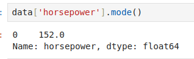
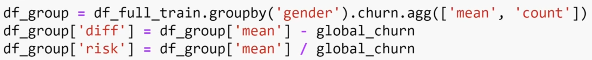

# Najczęstsza wartość kolumny

**Data:** 2025-10-19

---

**User:**

mam w pandas wczytany data frame a teraz chcę znaleźć najczęściej powtarzającą się wartość wy wybranej kolumnie

---

**Assistant:**

Aby znaleźć najczęściej powtarzającą się wartość (tzw. **modę**) w wybranej kolumnie DataFrame w Pandas, możesz użyć jednej z poniższych metod.  

Załóżmy, że Twój DataFrame to `df`, a interesująca Cię kolumna to `"kolumna"`.

---

### ✅ **Metoda 1 — użycie `mode()`**
```python
najczestsza = df["kolumna"].mode()[0]
print(najczestsza)
```
`mode()` zwraca serię (bo może być kilka wartości o tej samej częstości), więc `[0]` wybiera pierwszą z nich.

---

### ✅ **Metoda 2 — użycie `value_counts()`**
```python
najczestsza = df["kolumna"].value_counts().idxmax()
print(najczestsza)
```
`value_counts()` zwraca liczność każdej wartości w kolumnie, a `idxmax()` wybiera tę o największej liczbie wystąpień.

Jeśli chcesz także wiedzieć **ile razy** ta wartość występuje:
```python
liczba = df["kolumna"].value_counts().max()
print(najczestsza, liczba)
```

---

### ✅ **Metoda 3 — z użyciem `collections.Counter` (opcjonalnie)**
Jeśli z jakiegoś powodu chcesz to zrobić bez Pandas:
```python
from collections import Counter

najczestsza, liczba = Counter(df["kolumna"]).most_common(1)[0]
print(najczestsza, liczba)
```

---

Któraś z tych metod jest Ci bardziej potrzebna — np. chcesz tylko wartość, czy również liczbę jej wystąpień?

---

**User:**



w takim przypadku mogę zrobić data['horsepower'].mode()[0], a czy istnieje [1] albo ['Name'] ?

---

**Assistant:**

Dobre pytanie — już tłumaczę dokładnie, jak to działa:  

Kiedy wywołujesz:  
```python
data['horsepower'].mode()
```
otrzymujesz **Series**, która może zawierać **więcej niż jedną wartość**, jeśli kilka wartości występuje równie często (czyli jest wiele mod).  

Przykładowo:
```python
0    152.0
1    120.0
Name: horsepower, dtype: float64
```
Wtedy:
- `data['horsepower'].mode()[0]` → zwróci pierwszą modę (`152.0`),
- `data['horsepower'].mode()[1]` → zwróci drugą (`120.0`).

Natomiast jeśli w Twoim wyniku jest tylko **jedna wartość (jak na screenie)**:
```
0    152.0
Name: horsepower, dtype: float64
```
to:
- `data['horsepower'].mode()[0]` działa poprawnie,
- `data['horsepower'].mode()[1]` → spowoduje **IndexError**, bo nie ma drugiego elementu,
- `data['horsepower'].mode()['Name']` → również spowoduje **błąd**, bo `'Name'` to nie etykieta w serii, tylko metadana o nazwie kolumny (nie jest częścią indeksu).  

---

Podsumowując:
- Możesz używać `[0]`, `[1]`, `[2]`, … tylko jeśli faktycznie istnieje kilka mod.  
- `'Name'` nie jest dostępne jako klucz.  

Jeśli chcesz zobaczyć wszystkie mody w postaci listy:
```python
data['horsepower'].mode().tolist()
```

---

**User:**

co zwraca value_counts()? słownik?

---

**Assistant:**

Nie — `value_counts()` **nie zwraca słownika**, tylko **obiekt typu `pandas.Series`**.  

Każdy element tej serii reprezentuje wartość z kolumny oraz liczbę jej wystąpień.  
Klucze (indeks) to unikalne wartości, a wartości to liczności.

Przykład:  
```python
import pandas as pd

df = pd.DataFrame({
    "horsepower": [100, 120, 100, 152, 120, 100]
})

print(df["horsepower"].value_counts())
```

Wynik:
```
100    3
120    2
152    1
Name: horsepower, dtype: int64
```

Czyli:
- indeks (`100, 120, 152`) to wartości z kolumny,  
- wartości (`3, 2, 1`) to liczba ich wystąpień,  
- to **obiekt `Series`**, nie słownik.

---

Jeśli chcesz jednak dostać **prawdziwy słownik**, możesz łatwo przekonwertować:
```python
df["horsepower"].value_counts().to_dict()
```

Wynik:
```python
{100: 3, 120: 2, 152: 1}
```

---

**User:**

ok gdy mam df.my_prop == 'yes' to jaki typ jest zwracany?

---

**Assistant:**

Gdy wykonujesz:  
```python
df.my_prop == 'yes'
```
to wynik **nie jest** DataFrame’em ani kolumną w sensie danych źródłowych — to **obiekt typu `pandas.Series`** zawierający wartości typu `bool`.  

---

### 🔍 Dokładniej:
Każdy element serii to wynik porównania w danym wierszu:
- `True`, jeśli `my_prop` w tym wierszu ma wartość `'yes'`,  
- `False`, jeśli nie.

Przykład:
```python
import pandas as pd

df = pd.DataFrame({
    "my_prop": ["yes", "no", "yes", "maybe"]
})

mask = df.my_prop == "yes"
print(mask)
print(type(mask))
```

Wynik:
```
0     True
1    False
2     True
3    False
Name: my_prop, dtype: bool
<class 'pandas.core.series.Series'>
```

---

### 📌 Najczęstsze zastosowanie:
Taką serię boolowską wykorzystujesz jako **maskę filtrującą**:
```python
df_yes = df[df.my_prop == 'yes']
```
Wtedy Pandas zwróci tylko te wiersze, dla których warunek jest `True`.

---

**User:**

data[data.origin == 'Europe'][['vehicle_weight','model_year']][6:13]
wyjaśnij [6:13]  oraz
[6:]
[:6]
[:6:]

---

**Assistant:**

Świetne pytanie — chodzi tu o tzw. **slicing** (czyli wycinanie fragmentów) w Pandas / Pythonie.  
To dokładnie ta sama składnia, co w zwykłych listach Pythona.  

Załóżmy, że masz:
```python
df = data[data.origin == 'Europe'][['vehicle_weight','model_year']]
```
czyli nowy DataFrame z dwoma kolumnami i tylko wierszami, gdzie `origin == 'Europe'`.

---

### 🔹 `df[6:13]`
Zwraca **wiersze od indeksu 6 do 12 włącznie**, czyli:
- zaczyna od 6,
- kończy **przed** 13 (Python nie obejmuje górnej granicy),
- razem 7 wierszy.

📘 Przykład:
```python
df[6:13]  # wiersze 6,7,8,9,10,11,12
```

---

### 🔹 `df[6:]`
Zwraca wszystkie wiersze **od 6 do końca**:
```python
df[6:]  # od indeksu 6 do ostatniego
```

---

### 🔹 `df[:6]`
Zwraca pierwsze **6 wierszy** (od 0 do 5):
```python
df[:6]  # wiersze 0,1,2,3,4,5
```

---

### 🔹 `df[:6:]`
To zapis równoważny `df[:6]`.  
W Pythonie składnia `[start:stop:step]` pozwala też ustawić **krok** (`step`).  
Czyli:
```python
[start : stop : step]
```

Przykłady:
- `df[::2]` → co drugi wiersz (0, 2, 4, 6, …)
- `df[1:10:3]` → od wiersza 1 do 9, co 3 wiersze (1, 4, 7)
- `df[:6:]` → nie określa kroku, więc domyślnie krok = 1, czyli to samo co `df[:6]`

---

Podsumowując:
| Wyrażenie | Znaczenie |
|------------|------------|
| `[6:13]` | Wiersze od 6 do 12 |
| `[6:]` | Od 6 do końca |
| `[:6]` | Od początku do 5 |
| `[:6:]` | To samo co `[:6]`, krok = 1 (domyślnie) |

Chcesz, żebym pokazał przykład na małym DataFrame, jak to faktycznie działa (z konkretnymi wartościami)?

---

**User:**

chcę w df_num zastąpić null w kolumnie horsepower konkretną liczbą ale to nie działa
df2 = df.copy()
base = ['engine_displacement', 'horsepower', 'vehicle_weight', 'model_year']
df_num = df2[base]
df_num['horsepower'] = df_num['horsepower'].fillna(154)

---

**Assistant:**

Twój kod wygląda **prawie dobrze**, ale nie działa prawdopodobnie z powodu tzw. **SettingWithCopyWarning** — klasycznego problemu w Pandas, kiedy operujesz na **widoku** (view), a nie na **kopii** oryginalnego DataFrame’a.  

Przejdźmy po kolei:  

---

### 🔍 Co się dzieje
W tym fragmencie:
```python
df_num = df2[base]
```
tworzysz **widok** (a nie pełną kopię) fragmentu `df2`.  
Dlatego linia:
```python
df_num['horsepower'] = df_num['horsepower'].fillna(154)
```
może nie zadziałać — Pandas ostrzega, że nie jest pewien, czy modyfikujesz oryginalne dane, czy kopię.

---

### ✅ Poprawne sposoby

#### 🔸 1. Użyj `loc`:
To najlepszy, najbardziej „pandasonowy” sposób:
```python
df_num.loc[:, 'horsepower'] = df_num['horsepower'].fillna(154)
```
Dzięki `loc` Pandas wie, że chcesz zmienić konkretną kolumnę w istniejącym DataFrame’ie.

---

#### 🔸 2. Albo zrób prawdziwą kopię:
```python
df_num = df2[base].copy()
df_num['horsepower'] = df_num['horsepower'].fillna(154)
```
Dodanie `.copy()` tworzy niezależny DataFrame i eliminuje problem z widokiem.

---

#### 🔸 3. Ewentualnie możesz użyć `fillna` z parametrem `inplace=True`:
```python
df_num['horsepower'].fillna(154, inplace=True)
```
Ale ten sposób bywa mniej zalecany (bo `inplace=True` jest planowane do usunięcia w przyszłych wersjach Pandas).

---

### 💡 Szybkie podsumowanie
| Linia | Działa? | Komentarz |
|--------|----------|------------|
| `df_num = df2[base]` | ⚠️ może nie działać | widok, nie kopia |
| `df_num = df2[base].copy()` | ✅ | bezpieczna kopia |
| `df_num.loc[:, 'horsepower'] = df_num['horsepower'].fillna(154)` | ✅ | zalecany sposób |
| `df_num['horsepower'].fillna(154, inplace=True)` | ✅ | działa, ale mniej eleganckie |

---

Chcesz, żebym Ci pokazał, jak sprawdzić czy dana kolumna faktycznie ma wartości `NaN` po tej operacji (`isna().sum()` itd.)?

---

**User:**

ok zrobiłem
df_num.loc[:, 'horsepower'] = df_num['horsepower'].fillna(hp_mean)
a czy po tym 
df_num = df_num.fillna(0)
jest ok?

---

**Assistant:**

Tak 👍 — to jest **całkowicie poprawne** i bardzo często stosowane.  

Po tej linii:
```python
df_num.loc[:, 'horsepower'] = df_num['horsepower'].fillna(hp_mean)
```
zastąpiłeś `NaN` w kolumnie `horsepower` średnią (`hp_mean`).  
Następnie:
```python
df_num = df_num.fillna(0)
```
spowoduje, że **pozostałe** `NaN` (jeśli występują w innych kolumnach) zostaną zastąpione zerem.

---

### 🔍 Co dokładnie robi `fillna(0)`
Dla całego DataFrame’a:
- Przechodzi po **każdej kolumnie**,  
- Wszystkie `NaN` → `0`,  
- Zwraca **nowy DataFrame** (dlatego przypisanie `df_num = ...` jest poprawne).

---

### 💡 Uwaga
Jeśli chcesz, żeby `fillna(0)` modyfikowało dane **w miejscu**, możesz też napisać:
```python
df_num.fillna(0, inplace=True)
```
ale Twój sposób (`df_num = df_num.fillna(0)`) jest czystszy i bardziej kontrolowany — zwraca nowy obiekt bez ryzyka niejawnych modyfikacji.

---

Czyli:
✅ Twoja sekwencja:
```python
df_num.loc[:, 'horsepower'] = df_num['horsepower'].fillna(hp_mean)
df_num = df_num.fillna(0)
```
jest **poprawna, bezpieczna i zalecana.**

---

**User:**



w takim razie dlaczego działa takie przypisanie
df_group['diff'] = .... 
w tym przypadku


---

**Assistant:**

Świetne pytanie — to dotyka różnicy między **„widokiem” (view)** a **„kopią” (copy)** DataFrame’a w Pandas.  
Wyjaśnię to dokładnie na przykładzie Twojego kodu.

---

### 🔹 Dlaczego to działa:
```python
df_group = df_full_train.groupby('gender').churn.agg(['mean', 'count'])
df_group['diff'] = df_group['mean'] - global_churn
df_group['risk'] = df_group['mean'] / global_churn
```

Tutaj przypisania:
```python
df_group['diff'] = ...
df_group['risk'] = ...
```
**działają bez problemu**, ponieważ:
- `df_group` jest **pełnoprawnym DataFrame’em**,  
- nie jest **widokiem na inny DataFrame**, tylko **nowym obiektem**, zwróconym przez `groupby(...).agg(...)`.

---

### 🔍 Wcześniej problem był inny:
W przypadku:
```python
df_num = df2[base]
```
`df_num` nie był nowym DataFrame’em, tylko **widokiem fragmentu `df2`** — dlatego Pandas nie miał pewności, czy chcesz modyfikować `df2` czy tylko tymczasowy widok (stąd ostrzeżenie / brak efektu).

---

### 💡 W tym przypadku:
`groupby(...).agg(...)` **zawsze tworzy nowy obiekt**, niezależny od oryginalnego `df_full_train`.  
Nie ma więc żadnego ryzyka konfliktu między kopią a widokiem.  
Dlatego możesz bez problemu dodawać nowe kolumny:
```python
df_group['diff'] = ...
df_group['risk'] = ...
```
i Pandas zrobi to normalnie.

---

### 🔧 W skrócie:

| Sytuacja | Obiekt | Czy przypisanie działa bez ostrzeżenia |
|-----------|---------|----------------------------------------|
| `df_num = df2[base]` | widok (subset istniejącego DF) | ⚠️ może generować `SettingWithCopyWarning` |
| `df_num = df2[base].copy()` | pełna kopia | ✅ bezpieczne |
| `df_group = df.groupby(...).agg(...)` | nowy DataFrame | ✅ bezpieczne |

---

Czy chcesz, żebym pokazał, jak sprawdzić, czy dany obiekt Pandas jest „widokiem” czy „kopią” (przy pomocy `.is_copy`)?

---

**User:**

tak

---

**Assistant:**

OK — w Pandas możesz **sprawdzić, czy obiekt jest kopią czy widokiem** (czyli czy modyfikacje mogą wpływać na oryginał) za pomocą atrybutu:  

```python
df._is_copy
```

---

### 🔍 Przykład:
```python
import pandas as pd

df = pd.DataFrame({
    'a': [1, 2, 3],
    'b': [4, 5, 6]
})

# Utwórz "widok"
df_view = df[['a']]
# Utwórz pełną kopię
df_copy = df[['a']].copy()

print(df_view._is_copy)
print(df_copy._is_copy)
```

📘 Wynik może wyglądać mniej więcej tak:
```
<pandas.core.generic.NDFrame._is_copy>:
   <weakref at 0x00000237F...; to 'DataFrame' at 0x00000237F...>
None
```

---

### 💡 Interpretacja:
- Jeśli `df._is_copy` zwraca **`None`** → to **pełnoprawna kopia** (możesz ją bezpiecznie modyfikować).  
- Jeśli zwraca **`<weakref ...>`** → to **widok** (czyli Pandas tylko „odnosi się” do innego DataFrame’a).  
  Wtedy przypisania mogą być niepewne i generować `SettingWithCopyWarning`.

---

### ⚠️ Uwaga
`_is_copy` to **atrybut wewnętrzny** (oznaczony podkreśleniem), więc Pandas może go w przyszłości usunąć.  
Nie jest to oficjalnie wspierany mechanizm, ale w praktyce jest użyteczny do diagnostyki.  

---

### 🔧 Alternatywnie
Najpewniejszym sposobem uniknięcia problemu jest zawsze jawne kopiowanie:
```python
df_safe = df[['col1', 'col2']].copy()
```
lub użycie `.loc[]` przy przypisaniach.

---

Chcesz, żebym pokazał, jak w prosty sposób wykrywać przypadki, które **mogą generować `SettingWithCopyWarning`**, zanim Pandas je zgłosi?