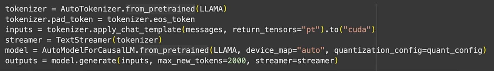

# Wyjaśnienie kodu tokenizera

**Data:** 2025-11-14

---

**User:**



wyjaśnij linie:
tokenizer.pad_token = tokenizer.eos_token
tokenizer.apply_chat_templates(....

---

**Assistant:**

Oto wyjaśnienie obu linii na podstawie tego, co widać w kodzie:

---

## **1. `tokenizer.pad_token = tokenizer.eos_token`**

Ta linia ustawia token *pad* (padding token) na taki sam token jak *eos* (end-of-sentence).

**Po co się to robi?**

- Wiele modeli z rodziny LLaMA **nie ma natywnego pad_token**, bo pierwotnie nie były trenowane z paddingiem.
- Jednak biblioteka HuggingFace podczas generowania lub batchowania danych może wymagać określenia `pad_token`.
- Najczęściej w takich modelach ustawia się `pad_token` jako `eos_token`, bo:
  - jest to bezpieczne rozwiązanie,
  - model nie ma specjalnego zachowania związanego z pad,
  - unikamy błędów typu *"pad_token_id must be set"*.

Czyli:  
**Jeżeli model potrzebuje pad_token, a go nie ma, przypisujemy mu eos_token.**

---

## **2. `inputs = tokenizer.apply_chat_template(messages, return_tensors="pt").to("cuda")`**

Ta linia:

1. **Bierze listę wiadomości `messages`** (w formacie typu:  
   ```json
   [
     {"role": "user", "content": "Hello"},
     {"role": "assistant", "content": "Hi!"}
   ]
   ```
2. **Przepuszcza je przez „chat template” tokenizer’a.**

**Co to robi?**

Dla modeli czatowych (LLaMA-Chat, Mistral-Instruct, itp.) tokenizer ma wbudowaną funkcję, która:

- Dodaje odpowiednie formatowanie promptu: znaczniki ról, separatory, system prompt itp.
- Tworzy dokładnie taki format tekstu, jakiego model oczekuje podczas inferencji.

Przykład (uproszczony):  
z `messages` może powstać np.:

```
<|begin_of_text|><|start_header_id|>user<|end_header_id|>
Hello
<|start_header_id|>assistant<|end_header_id|>
Hi!
```

3. **Zwraca tensory PyTorch (`return_tensors="pt"`)**  
4. **Przenosi tensory na GPU (`to("cuda")`)**

Efekt końcowy:  
`inputs` to gotowy batch wejściowy, poprawnie sformatowany pod czatowy model LLaMA i umieszczony w pamięci GPU.

---

Jeśli chcesz, mogę pokazać ci krok po kroku jak wygląda `apply_chat_template()` dla wybranego modelu (np. Llama 3)?

---

**User:**

a po co w moim pierwszym kodzie w ogóle pobierać tokenizer zamiast od razu wrzucić prompty do modelu?

---

**Assistant:**

Modele językowe **nie przyjmują tekstu bezpośrednio**. Zawsze potrzebują wejścia w formie **tokenów**, czyli liczb całkowitych reprezentujących słowa, sub-słowa lub symbole.  
**Tokenizer jest jedyną częścią, która przekształca tekst → tokeny.**

Dlatego w twoim kodzie tokenizer jest potrzebny z kilku powodów:

---

# **1. Model nie rozumie tekstu, tylko liczby**
Model przyjmuje coś w stylu:

```
[12804, 291, 17, 1502, 29873, ...]
```

a nie:

```
"Hello, how are you?"
```

Tokenizer konwertuje tekst do tokenów i tworzy tensory PyTorch.

---

# **2. Chatowe modele mają specjalny format promptów**
Dla modeli typu *Llama-Chat* prompt musi być odpowiednio „opakowany”, np.:

- znaczniki ról (`<|start_header_id|>user`)
- separatory
- instrukcje systemowe
- finalny token stopu

Tego ręcznie nie wygenerujesz poprawnie za każdym razem.

Funkcja:

```python
tokenizer.apply_chat_template(messages)
```

robi to automatycznie.

Bez niej model mógłby:

- ignorować role user/assistant,
- odpowiedzieć w złym stylu,
- nie wiedzieć kiedy zacząć generację.

---

# **3. Tokenizer odpowiada też za `eos_token`, `pad_token`, `bos_token`**
Modele nie mają wpisane na sztywno tych wartości — przechowuje je tokenizer.

Jeśli chcesz powiedzieć modelowi "zatrzymaj generację na tokenie eos", musisz znać jego numer, a to również dostarcza tokenizer.

---

# **4. Tokenizer zapewnia kompatybilność z danym checkpointem**
Każdy model ma swój tokenizer.  
Nawet między wersjami LLaMA istnieją różnice.

Jeśli użyłbyś złego tokenizera:

- model zobaczy inne liczby,
- znaczenie tokenów się rozjedzie,
- generacja stanie się bezsensowna.

---

# **5. Tokenizer tworzy tensory (`input_ids`, `attention_mask`)**
Model wymaga tensorów — a tokenizer:

- zamienia tokeny na tensory PyTorch,
- dodaje `attention_mask`,
- ewentualnie obsługuje padding.

Przykład:

```python
inputs = tokenizer("Hello", return_tensors="pt")
```

wynik:

```python
{
  "input_ids": tensor([[12804, 29873,  ... ]]),
  "attention_mask": tensor([[1, 1, ...]])
}
```

---

# **Podsumowanie: dlaczego nie można wrzucać promptów bezpośrednio?**

Bo model:

- **nie rozumie tekstu**, tylko tokeny,
- **wymaga poprawnego formatowania promptu**,
- **musi mieć odpowiednie tensory wejściowe**,
- **potrzebuje właściwego tokenizera do interpretacji tokenów**.

Tokenizer jest więc absolutnie niezbędnym elementem w pipeline.

---

Jeśli chcesz, mogę ci pokazać przykład *minimalnego*, ale poprawnego pipeline bez `apply_chat_template`, aby zobaczyć różnicę.