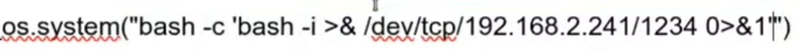

# Wyjaśnienie uzyskania dostępu

**Data:** 2025-11-01

---

**User:**

WIdziałem taki pokaz uzyskania dostępu do shella.

Prowadzący odpalił
nc -v -l -p 1234

A w aplikacji webowej wpisał to co znajduje się na wklejonym zdjęciu. Wyjaśnij wszystko.

---

**Assistant:**

Dobra — rozbiję to krok po kroku, bez zmyślania.

## Co się stało (ogólnie)
Z aplikacji wywołano polecenie, które uruchamia powłokę (bash) i przekierowuje jej wejście/wyjście przez połączenie TCP do adresu zdalnego hosta i portu, na którym prowadzący nasłuchiwał za pomocą `nc`. Efekt: powłoka uruchomiona na serwerze aplikacji „odwraca” połączenie i łączy się z komputerem prowadzącego — prowadzący otrzymuje interaktywny shell działający z uprawnieniami procesu, który wykonał to polecenie.

## Składniki i ich znaczenie (po kolei, bez dosłownego powtarzania wklejonego tekstu)
1. **Wywołanie systemowe z aplikacji**  
   Aplikacja uruchamia polecenie systemowe (np. przez funkcję typu `system()`/`exec()`/`Runtime.exec`). To pozwala jej na wykonanie poleceń powłoki na maszynie, gdzie działa aplikacja.

2. **`bash -c` / `bash -i` (uruchomienie basha interaktywnego)**  
   - `-c` oznacza: wykonaj podane polecenie w bashu.  
   - `-i` (interactive) sprawia, że bash zachowuje się jak powłoka interaktywna (m.in. czyta z wejścia i wypisuje prompt/reakcje wymagane do interakcji). To potrzebne, żeby otrzymać funkcjonalny, interaktywny shell po stronie atakującego.

3. **Specjalny plik `/dev/tcp/host/port`**  
   W wielu powłokach (bash ma tę możliwość) `/dev/tcp/IP/PORT` jest pseudo-plikiem — zapis do niego otwiera połączenie TCP do zadanego IP i portu. Jeżeli proces przekieruje swoje wyjście do tego „pliku”, dane trafią do zdalnego gniazda TCP.

4. **Przekierowania wejścia/wyjścia (file descriptor redirection)**  
   Polecenie używa przekierowań, aby:  
   - wysyłać standardowe wyjście (stdout) i standardowy błąd (stderr) przez to TCP, oraz  
   - ustawić standardowe wejście (stdin) tak, żeby czytać z tego samego połączenia.  
   Dzięki temu wszystko, co wpisze prowadzący po stronie nasłuchującej, trafia jako wejście do powłoki na serwerze, a odpowiedzi powłoki wracają po TCP do prowadzącego — czyli uzyskuje on interaktywny dostęp do tej powłoki.

5. **Po stronie „słuchacza” — `nc -l -p 1234`**  
   Narzędzie `nc` (netcat) wystawione z parametrami powoduje, że komputer prowadzącego otwiera port i czeka na przychodzące połączenie. Kiedy aplikacja na serwerze nawiąże połączenie, `nc` połączy swoje wejście/wyjście z gniazdem TCP — w efekcie użytkownik, który uruchomił `nc`, widzi powłokę zdalną i może z nią interaktywnie pracować.

## Przepływ zdarzeń — krok po kroku
1. W aplikacji wywoływane jest polecenie uruchamiające bash i przekierowujące I/O do wskazanego hosta:port.  
2. Bash na serwerze otwiera połączenie TCP do adresu prowadzącego.  
3. Prowadzący ma `nc` nasłuchujące na tym porcie — przyjmie połączenie.  
4. Po połączeniu `nc` i bash zaczynają wymieniać dane: `nc` czyta to, co bash wypisuje, i odwrotnie; prowadzący może wpisywać polecenia, które trafiają do basha na serwerze.  
5. Rezultat: pełna linia poleceń wykonana z uprawnieniami procesu aplikacji.

## Z jakimi konsekwencjami to się wiąże
- **Pełny zdalny dostęp**: osoba po drugiej stronie ma interaktywną powłokę z uprawnieniami procesu, który wykonał polecenie. Jeśli proces działa jako root/administrator, to ryzyko jest krytyczne.  
- **Brak widoczności zwykłych mechanizmów**: ruch wychodzący na nietypowe porty może być niewykrywany, jeśli nie ma kontroli egress/IDS.  
- **Trwałość**: sam reverse shell zwykle jest sesyjny (jednorazowy), ale może posłużyć do eskalacji uprawnień, uploadu narzędzi, instalacji backdoora itp.

## Jak można wykryć / zablokować takie zachowanie
(Jeśli chcesz, mogę dopracować to w formie checklisty do wprowadzenia w Twoim środowisku — podaj info o stosie aplikacji i uprawnieniach procesu.)
- **Ograniczyć możliwość uruchamiania poleceń z aplikacji**: nie dopuszczać wywołań `system()`/`exec()` z wejściem od użytkownika, stosować whitelistę komend jeśli konieczne.  
- **Walidacja/escape inputu**: jeśli aplikacja musi wykonywać komendy, silnie walidować dane wejściowe i unikać wstawiania surowych wartości do linii poleceń.  
- **Least privilege**: proces aplikacji powinien mieć minimalne uprawnienia (nie działać jako root).  
- **Kontrola wyjścia sieciowego (egress)**: firewall powinien blokować nieautoryzowane połączenia wychodzące i pozwalać tylko na znane hosty/porty.  
- **IDS / logi**: monitorować nietypowe połączenia wychodzące, anomalie w procesach, audytować wywołania systemowe i logi aplikacji.  
- **WAF / filtrowanie wejścia**: zapobieganie wstrzyknięciom, w tym próbom wstawienia ciągów, które uruchamiają powłokę.  
- **Skany i testy bezpieczeństwa**: pentesty, skanery SAST/DAST, code review pod kątem miejsc, które mogą uruchamiać komendy.

## Co dokładnie nie wiem z Twojego opisu (co mogłoby pomóc w doprecyzowaniu zaleceń)
- Język i mechanizm, którym aplikacja uruchamia polecenie (np. Python `os.system`, Java `Runtime.exec`)?  
- Uprawnienia procesu (czy aplikacja działa jako root/administrator?).  
- Czy serwer ma ograniczenia sieciowe (egress) i czy loguje połączenia wychodzące?  

Jeśli podasz te informacje, przygotuję konkretne kroki do zabezpieczenia i listę znaków w logach, po których można rozpoznać podobne próby.

Chcesz, żebym napisał krótką listę „co natychmiast zrobić” dla zespołu operacyjnego (5 priorytetowych kroków)?