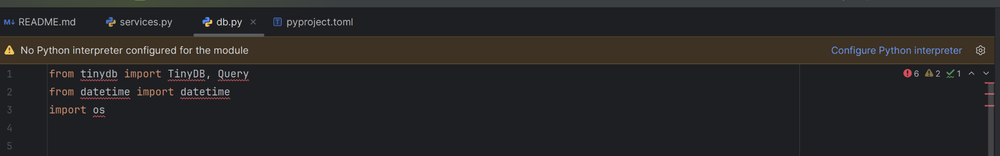

# Brak katalogu venv

**Data:** 2025-10-01

---

**User:**

mam projekt utworzony już przy pomocy uv w Python czyli uv init . już było wywołane. Teraz otwieram go na innym komputerze w intellij, po ściągnięciu repo z githuba i widzę że nie ma katalogu venv. Jak po winienem teraz postępować?

---

**Assistant:**

Rozumiem – masz projekt w Pythonie, który został zainicjalizowany przy pomocy **`uv init .`** (czyli narzędzia [uv](https://github.com/astral-sh/uv)), a teraz po sklonowaniu repo na innym komputerze w **IntelliJ** nie masz katalogu `venv`. To normalne – katalog środowiska wirtualnego zwykle nie powinien być wrzucany do GitHuba.  

Co zrobić teraz:  

1. **Upewnij się, że masz zainstalowany `uv`** na nowym komputerze.  
   ```bash
   pip install uv
   ```
   albo jeśli używasz `uv` jako binary:
   ```bash
   curl -LsSf https://astral.sh/uv/install.sh | sh
   ```

2. **Odtwórz środowisko wirtualne zdefiniowane w `pyproject.toml`**:  
   W katalogu projektu uruchom:
   ```bash
   uv sync
   ```
   To polecenie:  
   - utworzy nowe środowisko wirtualne (zwykle w `.venv/`),  
   - zainstaluje wszystkie zależności zdefiniowane w `pyproject.toml` i `uv.lock`.  

3. **Skonfiguruj IntelliJ / PyCharm**:  
   - Wejdź w *File → Settings → Project → Python Interpreter*.  
   - Wskaż interpreter znajdujący się w `.venv/bin/python` (Linux/macOS) albo `.venv\Scripts\python.exe` (Windows).  

4. (Opcjonalnie) Jeśli `.venv` nie został automatycznie utworzony, możesz wymusić utworzenie:  
   ```bash
   uv venv
   uv sync
   ```

---

Czy chcesz, żebym rozpisał krok po kroku jak to zrobić konkretnie w **IntelliJ IDEA** (które nie jest stricte PyCharmem, ale obsługuje Python plugin), czy wystarczy Ci ogólny opis powyżej?

---

**User:**



ok, działa. Jednak mam inny problem. Pomimo tego że w intellij wskazałem odpowiedni python w .venv nadal widzę takie błędy


---

**Assistant:**

Dobrze — opiszę konkretne kroki, które najczęściej rozwiązują ten komunikat i czerwone podkreślenia w Intellij (z uwzględnieniem Windows i *nix). Zrób je po kolei — większość problemów to źle przypisany interpreter do modułu lub brak zainstalowanych pakietów w tym interpreterze.

1. **Sprawdź, czy masz włączony Python plugin w IntelliJ**  
   `File → Settings → Plugins` → wyszukaj „Python” i upewnij się, że jest zainstalowany i włączony. (IntelliJ bez pluginu Python nie będzie prawidłowo analizować projektu.)

2. **Upewnij się, że wskazałeś właściwy interpreter projektu**  
   `File → Settings → Project: <nazwa_projektu> → Python Interpreter`  
   - Powinna tam być ścieżka do `.venv\Scripts\python.exe` (Windows) albo `.venv/bin/python` (Linux/macOS).  
   - Jeśli nie ma — kliknij „Add” → „Existing environment” → wskaż interpreter z `.venv`. Zapisz.

3. **Przypisz interpreter do modułu (jeśli nadal pojawia się banner „No Python interpreter configured for the module”)**  
   `File → Project Structure → Modules` → wybierz moduł (folder projektu) → zakładka *Dependencies* → w polu *Module SDK* wybierz interpreter (np. Python x.y from .venv). Zastosuj.

4. **Sprawdź, czy pakiety są zainstalowane w tym interpreterze**  
   Otwórz terminal w katalogu projektu (albo terminal systemowy) i aktywuj venv, potem sprawdź listę pakietów:
   - Windows:
     ```powershell
     .venv\Scripts\activate
     python -m pip install --upgrade pip
     pip list
     ```
   - Linux/macOS:
     ```bash
     source .venv/bin/activate
     python -m pip install --upgrade pip
     pip list
     ```
   Jeśli brakuje pakietów (np. `tinydb`), zainstaluj je:
   ```bash
   pip install tinydb
   ```
   Albo, jeśli korzystasz z `uv`:
   ```bash
   uv sync
   ```

5. **Sprawdź, jaki interpreter używa inspekcja kodu (Code Analysis)**  
   W Settings znajdź `Languages & Frameworks → Python` lub w `Editor → Inspections` → Python i sprawdź, czy inspekcje korzystają z projektowego interpretera. (Rzadziej potrzebne, ale bywa przyczyną rozbieżności).

6. **Odśwież interpreter / synchronizację**  
   - W `Python Interpreter` kliknij ikonę odświeżenia (jeśli jest) albo ponownie wybierz interpreter.  
   - W razie problemów: `File → Invalidate Caches / Restart...` → *Invalidate and Restart*.

7. **Sprawdź, czy plik `requirements.txt`, `pyproject.toml` / `uv.lock` jest aktualny**  
   Jeśli repo zawiera `pyproject.toml` i `uv.lock` — uruchom `uv sync`, wtedy venv będzie miał dokładnie te zależności. Jeśli nie masz `uv`, zainstaluj `uv` albo użyj `pip install -r requirements.txt`.

8. **Jeśli nadal widzisz podkreślenia przy wbudowanych modułach (np. `datetime`)**  
   To zwykle oznaka, że IDE wciąż nie ma przypisanego interpretera do modułu. Po wykonaniu kroków 2–3 problem powinien zniknąć. Jeśli nie — zrób Invalidate Caches/Restart.

---

Krótka lista poleceń, które warto wykonać w katalogu projektu (pod aktywowanym `.venv`):

```bash
python -m pip install --upgrade pip
uv sync        # jeśli używasz uv
# lub:
pip install -r requirements.txt
```

Jeśli chcesz, mogę wypisać dokładne kliknięcia dla Twojej wersji IntelliJ (Windows vs Linux/macOS) lub podać komendy do diagnostyki (np. `which python` / `where python`, `pip show tinydb`) — napisz tylko, na jakim systemie operacyjnym pracujesz.