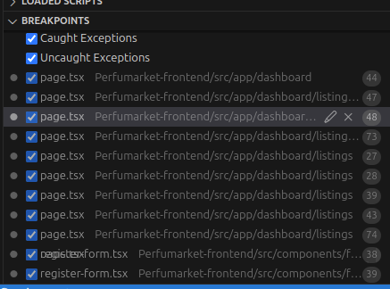

# Debugowanie Next.js w VSCode

**Data:** 2025-10-12

---

**User:**



Próbuję debugować aplikację Next.js w VSCode. To jest config
        {
            "type": "node",
            "request": "attach",
            "name": "Attach to Next.js",
            "port": 9229,
            "skipFiles": ["<node_internals>/**"]
        },

a wszystkie breakpointy są szare więc to nie działa

---

**Assistant:**

Szare breakpointy w VS Code oznaczają, że debugger nie jest poprawnie połączony z procesem, do którego mają być przypięte — w tym przypadku z Next.js uruchomionym w trybie debug. Twój config `"attach"` jest poprawny, ale żeby działał, proces Next.js **musi być uruchomiony z włączonym debugowaniem (inspektorem Node.js)**.  
Kroki, które trzeba sprawdzić:

---

### ✅ 1. Uruchom Next.js w trybie debug
Zamiast zwykłego `npm run dev`, uruchom:
```bash
NODE_OPTIONS='--inspect' npm run dev
```
lub (na Windowsie PowerShell):
```powershell
set NODE_OPTIONS=--inspect
npm run dev
```

Powinno się pojawić coś w stylu:
```
Debugger listening on ws://127.0.0.1:9229/xxxx
```

To oznacza, że Node nasłuchuje na porcie 9229 – czyli dokładnie tym, który masz w konfiguracji VSCode.

---

### ✅ 2. Połącz się debuggerem z VSCode
Wtedy dopiero odpal:
- `Run and Debug` (Ctrl+Shift+D)
- wybierz „Attach to Next.js”
- kliknij „Start Debugging (F5)”

Teraz breakpointy powinny się zapełnić (zmienić z szarych na czerwone).

---

### ⚙️ 3. Alternatywna konfiguracja (jeśli Next.js startuje własny serwer)
Jeśli Next uruchamiasz przez `next dev`, możesz zamiast *attach* użyć konfiguracji *launch*, np.:

```json
{
  "type": "node",
  "request": "launch",
  "name": "Launch Next.js",
  "runtimeExecutable": "npm",
  "runtimeArgs": ["run", "dev"],
  "port": 9229,
  "skipFiles": ["<node_internals>/**"],
  "env": {
    "NODE_OPTIONS": "--inspect"
  }
}
```

Ta wersja sama startuje serwer z debugerem.

---

### ⚠️ 4. Sprawdź mapy źródeł (source maps)
Jeśli nadal są szare:
- upewnij się, że masz zbudowany kod TypeScript (`.tsx`) → `.js` z mapami źródeł (`sourceMap: true` w `tsconfig.json`),
- a VSCode otwiera dokładnie te same ścieżki, które widzi Node.

---

### 🔍 5. Sprawdzenie połączenia
Możesz potwierdzić, że debuger działa:
```bash
curl http://127.0.0.1:9229/json/list
```
Zobaczysz listę sesji debugera. Jeśli brak — proces Next.js nie działa w trybie `--inspect`.

---

Chcesz, żebym pomógł ci przygotować kompletny działający `launch.json` pod typowy projekt Next.js (TypeScript + frontend w `app/`)?

---

**User:**

myślę że mój src folder nie jest oznaczony jako folder z kodem/źródłami w VSCode. Jak to zrobić?

---

**Assistant:**

To bardzo trafne podejrzenie — jeśli VS Code nie rozpoznaje Twojego `src/` jako źródła, breakpointy w `.tsx` (czy `.ts`) mogą być ignorowane lub szare, bo debugger nie potrafi powiązać ich z faktycznym kodem uruchomionym przez Node’a.  
Nie ma jednej opcji „oznacz jako folder z kodem”, ale są **trzy miejsca**, w których trzeba to ustawić lub sprawdzić, żeby VSCode i Node wiedziały, że `src/` zawiera źródła:

---

## 🧭 1. Upewnij się, że VSCode otwiera cały projekt
Otwórz **główny folder projektu**, np. ten, w którym masz `package.json`, a nie sam `src/`.

✅ Prawidłowo:  
```
Perfumarket-frontend/
 ├─ package.json
 ├─ tsconfig.json
 ├─ next.config.js
 └─ src/
     └─ app/
```

❌ Źle (jeśli otwierasz sam `src/` w VSCode):  
```
src/
 └─ app/
```

Bo wtedy VSCode nie ma kontekstu projektu (nie znajdzie `tsconfig.json`, map źródeł itp.).

---

## ⚙️ 2. Dodaj `outFiles` do `launch.json`
W configu debuggera trzeba powiedzieć, **gdzie znajdują się skompilowane pliki JS**, które odpowiadają Twoim plikom `.tsx`.

W Next.js (TypeScript) kod jest kompilowany dynamicznie, ale warto dodać ścieżkę do `src/**/*.js` oraz `.next`:

```json
{
  "type": "node",
  "request": "attach",
  "name": "Attach to Next.js",
  "port": 9229,
  "skipFiles": ["<node_internals>/**"],
  "outFiles": [
    "${workspaceFolder}/.next/**/*.js",
    "${workspaceFolder}/src/**/*.js"
  ]
}
```

To mówi VSCode: „te katalogi zawierają kod, do którego można mapować breakpoints”.

---

## 🧩 3. Sprawdź `tsconfig.json`
Upewnij się, że masz:
```json
{
  "compilerOptions": {
    "sourceMap": true,
    "rootDir": "src",
    "outDir": ".next"
  }
}
```
`sourceMap: true` jest kluczowe — bez tego debugger nie potrafi powiązać `.tsx` z faktycznym `.js`.

---

## 🔍 4. Opcjonalnie — wskaż folder `src` jako „sourceRoot”
Jeśli po tych zmianach VSCode dalej nie łączy map źródeł, można dopisać do `launch.json`:

```json
"sourceMaps": true,
"resolveSourceMapLocations": [
  "${workspaceFolder}/src/**/*",
  "${workspaceFolder}/.next/**/*"
]
```

---

## 🧰 5. Restart VSCode po zmianach
Po każdej modyfikacji `launch.json` lub `tsconfig.json` **zrestartuj VSCode** i **usuń wszystkie szare breakpointy** — dodaj je ponownie w nowym debug session.

---

Jeśli chcesz, mogę na podstawie Twojego projektu (`Perfumarket-frontend`) przygotować kompletny `launch.json` i `tsconfig.json` tak, żeby debugger zawsze działał dla Next.js + TypeScript (z `src/` i folderem `app/`).  
Czy chcesz, żebym to zrobił?

---

**User:**

gdzie mam wrzucić 
"sourceMaps": true,
"resolveSourceMapLocations": [
  "${workspaceFolder}/src/**/*",
  "${workspaceFolder}/.next/**/*"
]
do configuration?

---

**Assistant:**

Tak — dokładnie, te opcje dodajesz **wewnątrz obiektu `configuration`** (czyli obiektu reprezentującego pojedynczy „config” w `launch.json`), np. tego o nazwie `"Attach to Next.js"`.  

Czyli Twój plik `.vscode/launch.json` powinien wyglądać mniej więcej tak:

```json
{
  "version": "0.2.0",
  "configurations": [
    {
      "type": "node",
      "request": "attach",
      "name": "Attach to Next.js",
      "port": 9229,
      "skipFiles": ["<node_internals>/**"],
      "outFiles": [
        "${workspaceFolder}/.next/**/*.js",
        "${workspaceFolder}/src/**/*.js"
      ],
      "sourceMaps": true,
      "resolveSourceMapLocations": [
        "${workspaceFolder}/src/**/*",
        "${workspaceFolder}/.next/**/*"
      ]
    }
  ]
}
```

📍 **Gdzie to wstawić**:
- Plik powinien znajdować się w folderze `.vscode` w katalogu głównym projektu (`Perfumarket-frontend/.vscode/launch.json`).
- `sourceMaps` i `resolveSourceMapLocations` muszą być **na tym samym poziomie**, co `port`, `skipFiles` itd.  
  (czyli wewnątrz pojedynczego obiektu w tablicy `configurations`, nie obok niej).

---

💡 Po zapisaniu:
1. Zrestartuj VS Code (żeby debugger odczytał nową konfigurację).  
2. Uruchom serwer z `NODE_OPTIONS='--inspect' npm run dev`.  
3. W VS Code wybierz `Attach to Next.js` i kliknij **F5**.  

Po chwili breakpointy w `.tsx` powinny zmienić się z szarych na pełne czerwone (aktywny debug).