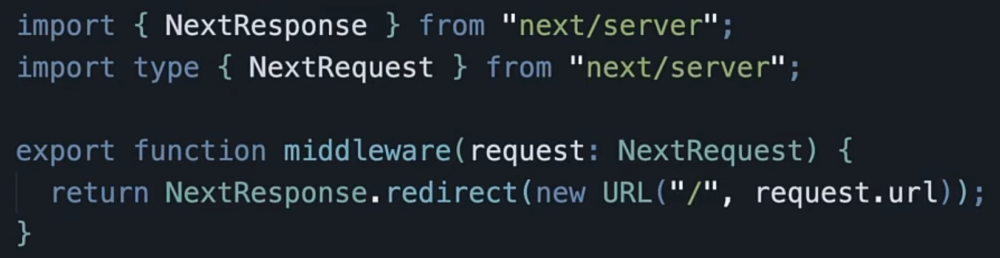

# Różnica między import a import type

**Data:** 2025-10-05

---

**User:**



jaka jest różnica między między import a import type?

---

**Assistant:**

Różnica między `import` a `import type` w TypeScript (a więc także w kodzie Next.js z TS) dotyczy tego, **czy import jest używany w runtime, czy tylko na etapie typowania**.  

Wyjaśnienie:

### 🔹 `import`
Zwykły `import`:
```ts
import { NextResponse } from "next/server";
```
- Importuje **rzeczywisty kod (runtime value)** — czyli coś, co faktycznie istnieje w czasie działania programu (np. funkcja, klasa, obiekt).  
- Kompilator TypeScript zachowuje ten import w wygenerowanym kodzie JavaScript.  
- Przykłady: funkcje, klasy, stałe, obiekty.

### 🔹 `import type`
Import typu:
```ts
import type { NextRequest } from "next/server";
```
- Importuje **tylko definicję typu** — nic nie trafia do kodu wynikowego (JavaScript).  
- Jest używany **wyłącznie podczas kompilacji TypeScript** do sprawdzania typów.
- Dzięki temu:
  - zmniejsza rozmiar bundle’a,
  - eliminuje niepotrzebne zależności w runtime,
  - pozwala uniknąć błędów typu „Cannot access before initialization” przy cyklicznych importach.

---

### Przykład różnicy po kompilacji:
Kod TS:
```ts
import { A } from "./lib";
import type { B } from "./types";

const a = new A();
let b: B;
```

Po transpilacji do JS:
```js
import { A } from "./lib";

const a = new A();
// brak importu dla B – został usunięty
```

---

W twoim przykładzie:
```ts
import { NextResponse } from "next/server";
import type { NextRequest } from "next/server";
```
- `NextResponse` jest obiektem wykorzystywanym w czasie działania (tworzy odpowiedź HTTP).
- `NextRequest` to **tylko typ**, który pomaga TypeScriptowi zrozumieć strukturę obiektu `request`.

---

Chcesz, żebym pokazał, jak zachowuje się ten sam plik po kompilacji do czystego JavaScript (żebyś zobaczył różnicę w praktyce)?

---

**User:**

ale skoro request jest później używany i odczytywany np. request.url, to jakim cudem szczegóły tego typu nie są potrzebne?\

---

**Assistant:**

Świetne i bardzo trafne pytanie — to intuicyjnie wygląda tak, jakby „typ” musiał być potrzebny w runtime, skoro coś z niego korzysta.  
Ale tu właśnie leży sedno różnicy między **typującym etapem kompilacji (TypeScript)** a **czasem wykonywania (JavaScript)**.  

---

### 🔹 1. Co robi TypeScript

TypeScript działa **tylko podczas kompilacji** — analizuje kod, żeby sprawdzić:
- jakie właściwości ma `request`,
- czy `request.url` istnieje i ma właściwy typ (np. `string`),
- czy przekazujesz do funkcji argumenty właściwego typu.

Ale po kompilacji **te wszystkie informacje o typach są usuwane**.  
Kiedy kod trafia do runtime (czyli do środowiska Next.js działającego w Node.js), nie ma już żadnych typów — jest tylko czysty JavaScript.

---

### 🔹 2. Co dzieje się w runtime

W runtime `request` to prawdziwy obiekt, przekazany przez Next.js middleware API.  
Ten obiekt **faktycznie istnieje w czasie działania** i zawiera właściwość `.url`.  

TypeScript nie musi go „znać” — on tylko podczas kompilacji sprawdził, że taki obiekt będzie miał `.url`.  
A w samym runtime Next.js dostarcza rzeczywistą implementację `NextRequest`, np.:

```js
{
  url: "https://example.com",
  method: "GET",
  headers: ...
}
```

Czyli:
- `import type { NextRequest }` mówi TypeScriptowi *„spodziewaj się takiego kształtu obiektu”*.
- Ale w runtime faktyczny obiekt `request` **jest tworzony przez Next.js**, nie przez TypeScript.

---

### 🔹 3. Dlaczego `import type` wystarcza

Bo `NextRequest` to **definicja interfejsu** (czyli informacja dla kompilatora).  
Nie musisz mieć w runtime tej definicji, bo obiekt `request` i tak pochodzi od Next.js — a nie z twojego kodu.  
Ty tylko mówisz TypeScriptowi:  
> „hej, potraktuj ten obiekt tak, jakby był typu `NextRequest`, żeby podpowiedzi IntelliSense i sprawdzanie typów działały”.

---

### 🔹 4. Wizualizacja

Podczas kompilacji:
```
middleware(request: NextRequest)
          ↑ typ znany TypeScriptowi
```

Po kompilacji (JS):
```js
export function middleware(request) {
  return NextResponse.redirect(new URL("/", request.url));
}
```
Widzisz? Typ `NextRequest` znika, ale `request` nadal istnieje — dostarczony przez Next.js middleware runtime.

---

Czy chcesz, żebym pokazał minimalny przykład, który pokaże ci tę różnicę „na żywo” — czyli kod `.ts` i wynikowy `.js` po kompilacji?