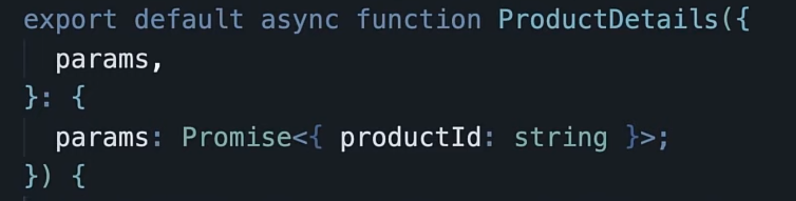

# Typy i parametry w TS

**Data:** 2025-10-03

---

**User:**



Wyjasnij znaczenie ({params ,}:{params: Promise....
Co tutaj jest parametrem, co typem itp

---

**Assistant:**

Patrzymy na ten fragment kodu TypeScript:  

```ts
export default async function ProductDetails({
  params,
}: {
  params: Promise<{ productId: string }>;
}) {
  ...
}
```

Rozbijmy to krok po kroku:

### 1. Nagłówek funkcji
```ts
export default async function ProductDetails( ... ) { ... }
```
- `export default` – eksportuje tę funkcję jako domyślną z pliku.  
- `async` – oznacza, że funkcja zwraca `Promise` i wewnątrz można używać `await`.  
- `ProductDetails` – nazwa funkcji.  

---

### 2. Parametr funkcji
```ts
({ params, }: { params: Promise<{ productId: string }> })
```

Tutaj mamy **destrukturyzację parametru** oraz przypisanie typu.

#### a) Lewa strona:
```ts
{ params, }
```
To znaczy, że funkcja przyjmuje **jeden argument** – obiekt, który ma właściwość `params`.  
Dzięki destrukturyzacji od razu wyciągamy `params` jako zmienną lokalną.

Czyli zamiast pisać:
```ts
function ProductDetails(props: { params: ... }) {
   const params = props.params;
}
```
piszemy krócej:
```ts
function ProductDetails({ params }: { params: ... }) {
   ...
}
```

#### b) Prawa strona:
```ts
: { params: Promise<{ productId: string }> }
```
To jest **typ całego argumentu funkcji**.  
Mówi, że funkcja przyjmuje **obiekt**, który wygląda tak:
```ts
{
  params: Promise<{ productId: string }>
}
```

Czyli `params` jest **obietnicą**, która po rozwiązaniu (`await`) zwróci obiekt w kształcie:
```ts
{ productId: string }
```

---

### 3. Jak to działa w praktyce
Przykład użycia:
```ts
ProductDetails({
  params: Promise.resolve({ productId: "123" })
});
```

W środku funkcji masz:
```ts
async function ProductDetails({ params }: { params: Promise<{ productId: string }> }) {
  const { productId } = await params;  // odczekujemy Promise i pobieramy productId
  console.log(productId); // "123"
}
```

---

✅ Podsumowanie:
- **Parametr funkcji**: `{ params }` → destrukturyzacja obiektu wejściowego.  
- **Typ parametru**: `{ params: Promise<{ productId: string }> }`.  
- `params` to `Promise`, który po `await` daje `{ productId: string }`.  

---

Chcesz, żebym rozpisał Ci też wersję **bez destrukturyzacji**, żeby porównać i łatwiej zrozumieć?