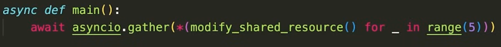

# Znak * w for

**Data:** 2026-02-06

---

**User:**



czym jest znak * w tym for comprehation?

---

**Assistant:**

W tym fragmencie:

```python
await asyncio.gather(*(modify_shared_resource() for _ in range(5)))
```

gwiazdka `*` **nie jest częścią** generator comprehension. Ona działa **na zewnątrz** niego.

To jest tzw. **argument unpacking (star-unpacking)**.

---

## Co faktycznie zwraca to wyrażenie w nawiasie?

To:

```python
(modify_shared_resource() for _ in range(5))
```

to **generator**, który produkuje 5 coroutine:

```
<coroutine 1>, <coroutine 2>, <coroutine 3>, <coroutine 4>, <coroutine 5>
```

Ale **to nadal jest jeden obiekt** — generator.

---

## Czego oczekuje `asyncio.gather`?

Sygnatura:

```python
asyncio.gather(*aws)
```

Czyli:

> podaj mi **wiele argumentów**, a nie jedną kolekcję.

Oczekuje czegoś w stylu:

```python
asyncio.gather(coro1, coro2, coro3, coro4, coro5)
```

---

## Co robi `*`?

```python
*(modify_shared_resource() for _ in range(5))
```

oznacza:

> rozpakuj generator na osobne argumenty funkcji

Czyli Python to zamienia logicznie na:

```python
asyncio.gather(
    modify_shared_resource(),
    modify_shared_resource(),
    modify_shared_resource(),
    modify_shared_resource(),
    modify_shared_resource(),
)
```

---

## Co by było bez `*`?

Gdybyś napisał:

```python
await asyncio.gather((modify_shared_resource() for _ in range(5)))
```

to `gather` dostałby **jeden argument** — generator.

I dostaniesz błąd w stylu:

```
TypeError: An asyncio.Future, a coroutine or an awaitable is required
```

bo generator **nie jest awaitable**.

---

## Dlaczego nie lista?

Można też tak:

```python
await asyncio.gather(*[modify_shared_resource() for _ in range(5)])
```

Ale generator + `*` jest:
- bardziej idiomatyczny
- nie tworzy listy w pamięci
- czytelniejszy dla kogoś, kto zna Pythona dobrze

---

## Podsumowanie

`*` tutaj oznacza:

> rozpakuj elementy generatora jako osobne argumenty funkcji

To jest klasyczny **star-unpacking w wywołaniu funkcji**, a nie element comprehension.

---

**User:**

czyli * tu rozwija a jest też zastosowanie gdzie "*" zwija tak?

---

**Assistant:**

Tak. W Pythonie `*` ma **dwie symetryczne role**:

| Kontekst | Co robi `*` | Mentalny model |
|---|---|---|
| wywołanie funkcji | **rozwija (unpack)** | z kolekcji → w wiele argumentów |
| definicja funkcji | **zwija (pack)** | z wielu argumentów → w kolekcję |
| przypisanie | **zwija (pack)** | resztę elementów → w listę |

---

## 1) Rozwijanie — to co widziałeś

```python
asyncio.gather(*coros)
print(*[1, 2, 3])   # print(1, 2, 3)
```

Kolekcja → osobne argumenty.

---

## 2) Zwijanie w definicji funkcji (`*args`)

```python
def f(*args):
    print(args)
```

Wywołanie:

```python
f(1, 2, 3)
```

W środku:

```
args == (1, 2, 3)
```

Wiele argumentów → jedna krotka.

To jest **dokładnie odwrotność** unpackingu.

---

## 3) Zwijanie przy przypisaniu (extended iterable unpacking)

```python
a, *rest = [1, 2, 3, 4]
```

Wynik:

```
a = 1
rest = [2, 3, 4]
```

Tu `*` oznacza:

> „zbierz całą resztę w listę”

Możesz też:

```python
*a, last = [1, 2, 3, 4]
```

```
a = [1, 2, 3]
last = 4
```

---

## 4) I jeszcze miks: unpack + pack

```python
first, *middle, last = range(10)
```

Tu jednocześnie:
- rozpakowujesz elementy,
- a część z nich pakujesz do listy.

---

## Intuicyjna zasada

`*` zawsze mówi Pythonowi:

> „tu jest **wiele elementów**, potraktuj je specjalnie”

- w wywołaniu funkcji: rozłóż je
- w definicji/przypisaniu: zbierz je

To jest jedna koncepcja użyta w dwóch kierunkach.