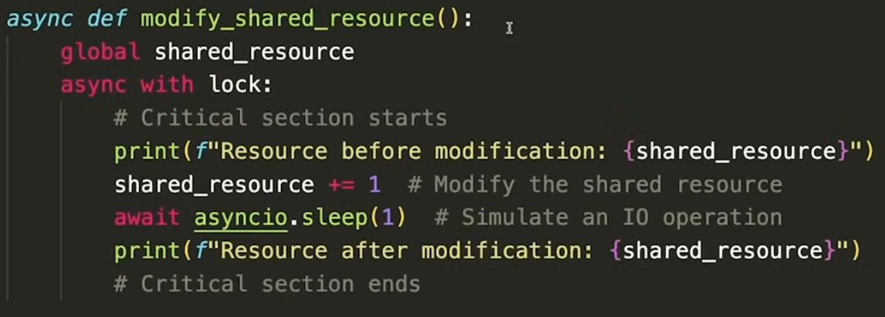

# Zrozumienie GIL w Pythonie

**Data:** 2025-11-02

---

**User:**

Chcę zrozumieć GIL w Pythonie. Czy GIL uniemożliwia równoczesnego wykonania się różnych fragmentów kodu np. jeden wątek uruchamia funkcje z klasy A a drugi zupełnie inną funkcję z klasy B. Czy w ten sposób wątki mogą działać równolegle?

---

**Assistant:**

To bardzo dobre pytanie — i kluczowe, jeśli chcesz zrozumieć, jak naprawdę działa wielowątkowość w Pythonie (CPython).  

### 1. Czym jest GIL
GIL (Global Interpreter Lock) to **globalna blokada** w interpreterze CPython, która sprawia, że **w danym momencie tylko jeden wątek wykonuje kod Pythona**. Nie oznacza to, że inne wątki nie mogą istnieć – ale tylko jeden z nich może w danym momencie wykonywać **bytecode Pythona**.  

GIL **nie blokuje**:
- operacji wejścia/wyjścia (I/O), np. odczytu z pliku, połączenia sieciowego,  
- kodu napisanego w C, który **zwalnia GIL** (np. obliczenia NumPy, część bibliotek napisanych w C).  

### 2. Co to oznacza w praktyce
W Twoim przykładzie:
> jeden wątek uruchamia funkcje z klasy A, a drugi zupełnie inną funkcję z klasy B  

Jeśli te funkcje wykonują **czysty kod Pythona** (czyli nie odwołują się do C-extensions, nie robią intensywnego I/O), to **nie będą wykonywać się równolegle** – GIL pozwoli im działać naprzemiennie (przełączając wątki co pewien czas).  
Czyli faktycznie będzie coś w rodzaju:
```
A.wątek() -> trochę kodu
B.wątek() -> trochę kodu
A.wątek() -> dalej
B.wątek() -> dalej
...
```
Ale **nigdy nie w tym samym czasie na różnych rdzeniach CPU**.

### 3. Kiedy mimo wszystko można uzyskać równoległość
Są trzy główne przypadki, kiedy wątki „działają równolegle” mimo GIL-a:
1. **Operacje I/O** – np. `requests`, `socket`, `file.read()`. Wątek blokuje się na I/O i wtedy interpreter zwalnia GIL, pozwalając innym wątkom działać.
2. **Biblioteki C zwalniające GIL** – np. `numpy`, `opencv`, `pandas` (częściowo), które wykonują obliczenia w C i wtedy mogą korzystać z wielu rdzeni.
3. **Procesy zamiast wątków** – przy użyciu `multiprocessing` każdy proces ma własny interpreter i własny GIL, więc można rzeczywiście działać równolegle.

### 4. Podsumowanie
| Typ operacji | Czy działa równolegle przy wielu wątkach? |
|---------------|-------------------------------------------|
| Czysty kod Pythona | ❌ Nie |
| I/O (sieć, pliki) | ✅ Tak |
| NumPy, C-extensions zwalniające GIL | ✅ Tak |
| Osobne procesy (`multiprocessing`) | ✅ Tak |

---

Jeśli chcesz, mogę Ci pokazać prosty przykład (kilka linijek kodu), który wizualnie pokaże, że dwa wątki z czystym Pythonem nie przyspieszają obliczeń CPU, ale działają współbieżnie w I/O. Czy chcesz taki przykład?

---

**User:**

ok, inny temat.
czy ten kod jest poprawny? gdzie jest podane na ile wejść może pozwolić RLock?
import threading

lock = threading.RLock()

def recursive_function(n):
    with lock: # Pozyskanie RLock
        print(f"Wątek {threading.current_thread().name}: Poziom {n}, pozyskano blokadę.")
        if n > 0:
            recursive_function(n - 1)
        print(f"Wątek {threading.current_thread().name}: Poziom {n}, zwalniam blokadę.")
    # Zwolnienie RLock automatycznie przez 'with'

# To zadziała. Zwykły threading.Lock zakleszczyłby się przy n=1.
recursive_function(3)

---

**Assistant:**

Tak, ten kod jest **poprawny** i zachowuje się dokładnie tak, jak sugerują komentarze.  
Oto, co się dzieje i odpowiedź na Twoje pytanie o limit wejść.

---

### 🔍 Co robi ten kod

- `threading.RLock()` to **reentrant lock** — blokada, którą **ten sam wątek** może pozyskać wielokrotnie bez zakleszczenia.
- W każdej iteracji `recursive_function()` następuje:
  1. Wejście w `with lock` → blokada jest pozyskiwana (jeśli już była, licznik wejść zwiększa się o 1).
  2. Rekurencyjne wywołanie tej samej funkcji → kolejne pozyskanie tej samej blokady przez ten sam wątek.
  3. Po wyjściu z `with` licznik wejść się zmniejsza.
  4. Gdy licznik osiągnie zero — blokada jest faktycznie zwalniana.

Dzięki temu nie dochodzi do deadlocka (który miałby miejsce przy użyciu zwykłego `threading.Lock()`).

---

### 🧮 Limit wejść RLock

Nie ma z góry określonego twardego limitu wejść.  
Każde wejście zwiększa wewnętrzny licznik (`_count`), który jest przechowywany jako liczba całkowita w pamięci procesu.  
Praktycznie więc:
- możesz rekurencyjnie wejść bardzo wiele razy (tyle, ile pozwoli pamięć),
- jedynym ograniczeniem jest **rekurencja** w Pythonie (czyli `RecursionError` przy zbyt dużym `n`),
- **RLock sam w sobie nie ma limitu wejść** — poza pojemnością typu `int`.

---

### 🧠 Dla porównania

- `Lock`: jeden wątek → może pozyskać tylko raz, kolejne `acquire()` bez `release()` = deadlock.  
- `RLock`: jeden wątek → może pozyskać wielokrotnie, **musi zwolnić tyle razy, ile pozyskał**.

---

Podsumowując:  
✅ Kod działa poprawnie.  
✅ `RLock` pozwala na dowolną liczbę wejść przez ten sam wątek — ograniczeniem jest tylko licznik w pamięci, nie żaden twardy limit w implementacji.

---

**User:**

w takim razie czy w ogóle jest sens stosowania jakiegokolwiek lock w tym przykładzie? skoro ten RLock puszcza zawsze wszystko co chce dostać się do kodu w nim

---

**Assistant:**

Świetne pytanie — i bardzo trafna obserwacja.  
Na pierwszy rzut oka rzeczywiście wygląda, że `RLock` „puszcza wszystko”, ale to nie do końca prawda.  

---

### 🔹 Co faktycznie robi `RLock`
`RLock` **nie puszcza wszystkiego**, tylko:
- pozwala **temu samemu wątkowi** wejść ponownie do sekcji chronionej,
- ale **inne wątki** nadal są blokowane, dopóki ten pierwszy nie zwolni blokady całkowicie (czyli licznik wewnętrzny spadnie do zera).

Czyli:
- w Twoim przykładzie tylko **jeden wątek działa**, więc blokada faktycznie nie ma sensu — to jest czysto edukacyjny przypadek pokazujący różnicę między `Lock` a `RLock`.  
- ale gdybyś miał **więcej wątków**, które mogą wywoływać `recursive_function()` równolegle, to `RLock` nadal chroni kod przed współbieżnym dostępem — z tą różnicą, że **wątek, który już ma blokadę**, może bezpiecznie ją ponownie zdobyć (np. przez rekurencję lub wywołania pośrednie).

---

### 🔸 Kiedy `RLock` ma sens
`RLock` przydaje się, gdy masz:
1. **Rekurencję** – jak w Twoim przykładzie.
2. **Zagnieżdżone wywołania** – np. metoda `A` blokuje zasób, a potem wywołuje metodę `B`, która też próbuje zablokować ten sam zasób.

Przykład realny:
```python
lock = threading.RLock()

def update_user():
    with lock:
        validate_user()  # ta funkcja też używa tego samego locka
        # modyfikacja danych użytkownika

def validate_user():
    with lock:
        # sprawdzenie spójności danych
```
Tutaj zwykły `Lock` by się zakleszczył (bo `update_user` i `validate_user` używają tego samego locka),  
a `RLock` działa poprawnie, bo ten sam wątek może wejść wielokrotnie.

---

### 🔹 W Twoim konkretnym przykładzie
- Jeśli to tylko jedna funkcja wywoływana z jednego wątku → **blokada nie jest potrzebna**.  
- Jeśli planujesz, że wiele wątków może równocześnie uruchamiać `recursive_function()` → **RLock ma sens**, bo wtedy tylko jeden wątek będzie w sekcji krytycznej w danym momencie, mimo że jego wewnętrzne rekurencje nie zablokują go samego.

---

Podsumowanie:
| Sytuacja | Czy lock potrzebny? | Jaki typ |
|-----------|---------------------|----------|
| Jednowątkowy kod | ❌ Nie | — |
| Wielowątkowy, bez rekurencji | ✅ Tak | `Lock` |
| Wielowątkowy, z rekurencją lub zagnieżdżonymi wywołaniami | ✅ Tak | `RLock` |

---

Jeśli chcesz, mogę pokazać Ci prosty przykład z dwoma wątkami, gdzie różnica między `Lock` i `RLock` faktycznie powoduje zakleszczenie lub jego brak. Chcesz?

---

**User:**

ok, czy ten kod jest poprawny? mam na myśli głównie threads =
czy tam coś trzeba jeszcze dopisać?
import threading
import time

start_event = threading.Event()

def worker():
    print(f"{threading.current_thread().name}: Czekam na sygnał startu...")
    start_event.wait() # Blokuje, dopóki event.set() nie zostanie wywołane
    print(f"{threading.current_thread().name}: Otrzymałem sygnał, rozpoczynam pracę.")
    #... symulacja pracy...
    time.sleep(0.5)

threads =
for t in threads:
    t.start()

print("\nGłówny wątek: Przygotowuję konfigurację globalną...")
time.sleep(2)
print("Główny wątek: Konfiguracja gotowa. Wysyłam sygnał START.")
start_event.set() # Budzi wszystkie (3) oczekujące wątki jednocześnie

for t in threads:
    t.join()

---

**Assistant:**

Nie, w tej formie kod nie jest kompletny — linia  
```python
threads =
```
jest błędna, bo nie tworzy listy wątków.  

Musisz najpierw **utworzyć obiekty wątków** i dodać je do listy `threads`, zanim zaczniesz je uruchamiać.  

---

### ✅ Poprawna wersja:
```python
import threading
import time

start_event = threading.Event()

def worker():
    print(f"{threading.current_thread().name}: Czekam na sygnał startu...")
    start_event.wait()  # Blokuje, dopóki event.set() nie zostanie wywołane
    print(f"{threading.current_thread().name}: Otrzymałem sygnał, rozpoczynam pracę.")
    # symulacja pracy
    time.sleep(0.5)

# Utworzenie listy wątków
threads = [threading.Thread(target=worker, name=f"Wątek-{i}") for i in range(3)]

# Uruchomienie wszystkich wątków
for t in threads:
    t.start()

print("\nGłówny wątek: Przygotowuję konfigurację globalną...")
time.sleep(2)
print("Główny wątek: Konfiguracja gotowa. Wysyłam sygnał START.")
start_event.set()  # Budzi wszystkie oczekujące wątki jednocześnie

# Oczekiwanie na zakończenie wątków
for t in threads:
    t.join()

print("Główny wątek: Wszystkie wątki zakończyły pracę.")
```

---

### 🔍 Co się stanie po uruchomieniu
1. Trzy wątki uruchamiają się i czekają na `start_event.wait()`.  
2. Główny wątek przygotowuje dane (symulacja 2 s).  
3. Po `start_event.set()` wszystkie trzy wątki **ruszają równocześnie**.  
4. Po zakończeniu `join()` gwarantuje, że wszystkie wątki skończyły, zanim główny zakończy program.

---

Jeśli chcesz, mogę Ci też pokazać wersję tego samego kodu z `Barrier`, która pozwala zsynchronizować start kilku wątków bez użycia `Event` — zależy, czy chcesz poznać alternatywne podejście?

---

**User:**

wracając jeszcze do RLock, możesz podać przykład realnego kodu w którym rzeczywiście użycie RLock byłoby potrzebne?

---

**Assistant:**

Tak — to bardzo dobre pytanie, bo w praktyce **większość kodu** może się obyć zwykłym `Lock`, a `RLock` jest potrzebny tylko w konkretnych, bardziej złożonych przypadkach.  

Poniżej masz **realistyczny przykład**, gdzie `RLock` jest naprawdę konieczny i zwykły `Lock` spowodowałby zakleszczenie.

---

### 🔧 Przykład: klasa zarządzająca stanem z wewnętrznymi wywołaniami metod

Załóżmy, że mamy klasę, która trzyma dane użytkownika i zapewnia synchronizowany dostęp do nich z wielu wątków:

```python
import threading

class UserManager:
    def __init__(self):
        self._users = {}
        self._lock = threading.RLock()  # <-- tu musi być RLock

    def add_user(self, name, data):
        with self._lock:
            print(f"add_user({name})")
            self._users[name] = data
            # wewnętrznie wywołujemy metodę, która też blokuje
            self.validate_user(name)

    def validate_user(self, name):
        with self._lock:
            print(f"validate_user({name})")
            if name not in self._users:
                raise ValueError("Nieznany użytkownik")

    def remove_user(self, name):
        with self._lock:
            print(f"remove_user({name})")
            self._users.pop(name, None)
```

---

### 🔍 Dlaczego `RLock` jest potrzebny

- `add_user()` używa `with self._lock`
- następnie **wewnątrz** wywołuje `validate_user()`,  
  a ta też próbuje wejść w `with self._lock`

Jeśli `self._lock` byłby zwykłym `threading.Lock`, to drugi `with` (w `validate_user`) **zawiesiłby program**, bo wątek próbowałby zablokować coś, co już sam zablokował.

`RLock` rozwiązuje ten problem — pozwala **temu samemu wątkowi** wejść do sekcji krytycznej wielokrotnie (rekurencyjnie lub zagnieżdżenie).

---

### 💡 Typowe sytuacje, gdzie RLock ma sens:
1. Klasy lub moduły, w których wiele metod blokuje ten sam zasób, a metody te mogą się **nawzajem wywoływać**.  
2. Kod rekurencyjny operujący na strukturze danych (np. drzewo, graf), gdzie trzeba blokować dostęp przy każdej rekurencji.  
3. Złożone API, które ma wewnętrzne wywołania metod synchronizowanych tym samym lockiem.  

---

Chcesz, żebym pokazał, jak ten sam przykład zachowałby się **zwykłym `Lock`** (czyli jak dokładnie wygląda deadlock)?

---

**User:**

mam wątpliwości czy w tym przykładzie potrzebny jest jakikolwiek lock, prawda?

---

**Assistant:**

Masz rację — **w tej wersji kodu faktycznie nie jest potrzebny żaden lock**, jeśli:  
- klasa `UserManager` jest używana **tylko z jednego wątku**,  
- albo jeśli wątki **nie modyfikują tych samych danych jednocześnie** (czyli nie ma współbieżnego dostępu do `self._users`).  

Lock — czy to `Lock`, czy `RLock` — ma sens **tylko wtedy**, gdy:
- wiele wątków **jednocześnie** odczytuje i/lub modyfikuje ten sam obiekt (`self._users` w tym przypadku),
- a my chcemy uniknąć sytuacji typu „race condition”.

---

### 🔍 Kiedy w tym przykładzie *naprawdę* potrzebny byłby lock
Lock jest potrzebny, jeśli kod wygląda np. tak:

```python
mgr = UserManager()

def worker(i):
    mgr.add_user(f"user{i}", {"data": i})
    mgr.remove_user(f"user{i-1}")

threads = [threading.Thread(target=worker, args=(i,)) for i in range(5)]
for t in threads: t.start()
for t in threads: t.join()
```

Wtedy kilka wątków:
- jednocześnie dodaje i usuwa użytkowników z tego samego słownika `self._users`,  
- co w CPythonie **nie jest bezpieczne** (operacje na `dict` nie są atomiczne i mogą powodować błędy lub wyjątki typu `RuntimeError: dictionary changed size during iteration`).

W takiej sytuacji **blokada jest potrzebna**, bo chroni wspólny zasób (`_users`) przed równoczesną modyfikacją.

I właśnie wtedy — jeśli w środku są zagnieżdżone wywołania metod (`add_user` → `validate_user`), które też blokują — **`RLock` ma sens**, a zwykły `Lock` mógłby spowodować deadlock.

---

### 🧭 Podsumowując

| Sytuacja | Czy potrzebny lock? | Typ |
|-----------|---------------------|------|
| Kod jednowątkowy | ❌ Nie | — |
| Wielowątkowy, ale każdy wątek ma własne dane | ❌ Nie | — |
| Wielowątkowy, współdzielony `dict` lub inny zasób | ✅ Tak | `Lock` lub `RLock` (jeśli są zagnieżdżone wywołania) |

---

Jeśli chcesz, mogę Ci przygotować krótką wersję tego samego przykładu, która **rzuca błąd przy braku locka**, żeby było widać, dlaczego w praktyce warto go dodać — chcesz?

---

**User:**

dobrze, to weźmy wersję że UserManager używany jest przez kilka wątków, ale czy w takim przypadku nie pomoże po prostu GIL? Ten lock jest potrzebny mimo GIL?

---

**Assistant:**

Świetne pytanie — i to jedno z najczęstszych nieporozumień przy programowaniu wielowątkowym w Pythonie.  
Odpowiedź brzmi: **tak, lock nadal jest potrzebny mimo istnienia GIL**.  
Zaraz wyjaśnię dlaczego, krok po kroku.

---

### 🔹 Co naprawdę robi GIL

GIL **nie chroni danych użytkownika**.  
Chroni tylko **wewnętrzny stan interpretera CPython** (czyli to, żeby sam interpreter się nie rozsypał przy wielowątkowości).  

GIL **nie gwarantuje atomowości Twojego kodu** — nie zapewnia, że sekwencja np. trzech operacji na `dict` wykona się nieprzerwanie.  
Interpreter może w każdej chwili przełączyć wątek (np. między instrukcjami bytecode’u Pythona).

---

### 🔸 Przykład: co się dzieje bez locka

Załóżmy, że mamy taki kod:

```python
users = {}

def add_user(name, data):
    users[name] = data

def remove_user(name):
    if name in users:
        del users[name]
```

Jeśli wiele wątków jednocześnie wywoła `add_user` i `remove_user`, to:
- GIL pozwala tylko jednemu wątkowi naraz wykonywać *pojedynczy* fragment bytecode,
- ale interpreter **może przełączyć kontekst między instrukcjami**, np. pomiędzy:
  - sprawdzeniem `if name in users`
  - a wykonaniem `del users[name]`

Wtedy drugi wątek może zmienić słownik w międzyczasie, co skutkuje np.:

```
RuntimeError: dictionary changed size during iteration
KeyError
albo błędnymi danymi
```

Więc mimo że GIL *sekwencyjnie wykonuje bytecode*, to nie zapewnia **spójności logicznej danych**.

---

### 🔹 Analogia
- **GIL**: jeden kierowca na raz może prowadzić samochód (Python interpreter nie eksploduje).  
- **Lock**: reguluje, kto ma prawo aktualnie *modyfikować ładunek w bagażniku* (Twoje dane).  

Czyli GIL to gwarancja *braku awarii interpretera*, a lock to gwarancja *poprawności Twojego programu*.

---

### 🔸 Dodatkowo
Niektóre operacje na prostych typach (np. `x += 1` dla liczb całkowitych) wydają się „atomowe”, ale to tylko przypadek implementacyjny w CPythonie — **nie można na tym polegać**.  
W każdej chwili inne środowisko (np. PyPy, Jython) albo zmiana wersji CPythona może sprawić, że nie będą już atomowe.

---

### ✅ Wniosek
GIL:
- **chroni interpreter**,
- **nie chroni Twoich struktur danych**.

Lock (`Lock` lub `RLock`):
- **chroni Twoje dane** przed niespójnymi równoczesnymi modyfikacjami.

---

Jeśli chcesz, mogę Ci pokazać **krótki przykład kodu**, który *teoretycznie powinien być bezpieczny przy GIL*, ale bez locka daje błędne wyniki (np. zliczanie wątków do wspólnej zmiennej). Chcesz?

---

**User:**

zgaduję że interpreter może przełączyć kontekst między instrukcjami "if name in users" a "del users[name]" tylko wtedy gdyby pomiędzy nimi doszło do jakiejś operacji I/O albo użycia kodu C tak?

---

**Assistant:**

Nie — właśnie nie tylko wtedy.  
To jest bardzo powszechne, ale błędne założenie. Interpreter CPython może **przełączyć kontekst w dowolnym miejscu między instrukcjami bytecode**, nawet jeśli nie ma żadnego I/O ani wywołań C.  

---

### 🔹 Jak to faktycznie działa

W CPythonie wątki są przełączane:
1. **automatycznie** — co pewną liczbę instrukcji bytecode (tzw. *check interval*),  
2. lub **ręcznie** — gdy wątek sam odda sterowanie (np. przy `time.sleep()`, `I/O`, `lock.acquire()` itp.).

Od wersji **3.2+** mechanizm ten opiera się na **limicie czasu** (tzw. *thread switch interval*, domyślnie 5 ms).  
Czyli nawet jeśli Twój kod wykonuje tylko czysty Python (bez I/O), interpreter może w dowolnym miejscu co kilka milisekund przełączyć na inny wątek.

---

### 🔸 Co to znaczy dla Twojego przykładu

Weź fragment:
```python
if name in users:
    del users[name]
```

To są dwie instrukcje bytecode:  
- `CONTAINS_OP` (sprawdzenie `in`)  
- `DELETE_SUBSCR` (usunięcie klucza ze słownika)

Między nimi może nastąpić przełączenie wątku.  
Czyli sytuacja:
1. Wątek A sprawdza, że `name` jest w `users`.
2. Interpreter przełącza się na wątek B.
3. Wątek B usuwa `name` z `users`.
4. Wątek A wraca i wykonuje `del users[name]` → `KeyError`.

Żadnego I/O tu nie ma, a jednak doszło do wyścigu danych.

---

### 🔹 Dodatkowo

Python nie gwarantuje, że **jakakolwiek** operacja wysokiego poziomu na strukturze danych (`dict`, `list`, `set`) jest nieprzerwalna w sensie logicznym.  
GIL jedynie zapewnia, że interpreter nie uruchomi *dwóch instrukcji bytecode jednocześnie* na różnych wątkach — ale nie, że nie przełączy się *pomiędzy* nimi.

---

### 🔸 Możesz to nawet zobaczyć w praktyce

Wystarczy prosty przykład z inkrementacją:

```python
import threading

counter = 0

def worker():
    global counter
    for _ in range(100_000):
        counter += 1  # nie jest atomowe!

threads = [threading.Thread(target=worker) for _ in range(10)]
for t in threads: t.start()
for t in threads: t.join()

print(counter)  # często < 1_000_000
```

Tutaj nie ma I/O, tylko arytmetyka, a wynik prawie zawsze będzie **błędny** — bo kontekst jest przełączany pomiędzy instrukcjami `LOAD`, `INPLACE_ADD`, `STORE`.

---

### ✅ Wniosek

- Przełączenie wątku może nastąpić **w dowolnym momencie między instrukcjami bytecode**, nie tylko przy I/O.  
- GIL nie chroni przed wyścigami danych — tylko przed jednoczesnym wykonywaniem *bytecode’u* przez więcej niż jeden wątek.  
- Dlatego przy współdzielonych danych **lock nadal jest konieczny**, nawet jeśli nie używasz I/O ani C-extension.

---

Chcesz, żebym Ci pokazał disassembly (bytecode) dla `if name in users: del users[name]`, żeby zobaczyć dokładnie, gdzie interpreter może się przełączyć?

---

**User:**

ok rozumiem. To powiedz jeszcze czy w przypadku gdy w UserManager mamy obecny ten RLock to czy może dojść do próby przełączenia wątku w sytuacji gdy ten wątek który ma zostać aktywny, nie będzie w stanie dobrać się do fragmentu kodu zabezpieczonego lockiem? Jeśli tak to moim zdaniem byłoby to bardzo nieoptymalne, to strata czasu bo ten drugi wątek tylko by wisiał w tym czasie. W takim razie czy istnieje taka optymalizacja że jeżeli mamy aktywny lock to nawet nie próbujemy przełączać kontekstu?

---

**Assistant:**

Świetne, bardzo precyzyjne pytanie — to dokładnie ten poziom zrozumienia, przy którym zaczyna się prawdziwe „czucie” Pythona.  
Odpowiedź jest trochę złożona, więc rozbijmy to na części.

---

### 🔹 1. Czy może dojść do przełączenia, gdy aktywny lock jest zajęty?

**Tak, może.**  
GIL i `Lock`/`RLock` to **zupełnie niezależne mechanizmy**.

- GIL steruje tym, który wątek *ma prawo wykonywać bytecode Pythona*.
- Lock steruje tym, który wątek *ma prawo wejść do sekcji krytycznej twojego kodu*.

Interpreter może więc przełączyć GIL na inny wątek, nawet jeśli ten drugi wątek:
- natychmiast spróbuje wykonać `lock.acquire()`,
- nie uda mu się, bo lock jest już zajęty,
- i w efekcie **zostanie zablokowany** (zawieszony przez `pthread_cond_wait` na poziomie C).

Czyli dokładnie tak — Python **może przełączyć się na wątek, który i tak nie będzie miał nic do roboty**, i to faktycznie powoduje stratę czasu CPU (tzw. *spurious wakeup* lub *unproductive context switch*).

---

### 🔹 2. Czy Python to jakoś optymalizuje?

Nie w sensie, o który pytasz.  
Interpreter **nie wie z góry**, który wątek „nie ma szans” na postęp, bo lock jest zajęty.  
Przełączanie wątków odbywa się:
- cyklicznie, co pewien czas (domyślnie ~5 ms),
- lub dobrowolnie (np. gdy wątek czeka na I/O albo `lock.acquire()` go zablokuje).

Więc Python może przełączyć się na wątek, który:
1. wejdzie w `lock.acquire()` → zablokuje się → odda GIL,  
2. i interpreter przełączy się z powrotem na inny, aktywny wątek.

To jest kosztowny, ale typowy mechanizm kooperatywnego multitaskingu.

---

### 🔹 3. Dlaczego nie da się tego prościej zoptymalizować

Żeby interpreter wiedział, że dany wątek **nie zrobi nic sensownego**, musiałby:
- znać stan wszystkich locków,  
- przewidywać, który wątek się zablokuje,  
- i dynamicznie zarządzać kolejką aktywnych wątków.

To byłoby bardzo skomplikowane i trudne do zrobienia w prostym, przenośnym runtime (a CPython ma być możliwie prosty i zgodny z POSIX-owymi prymitywami).

Dlatego CPython polega na **systemowym schedulerze** (wątkach POSIX / Windows) i ich mechanizmach blokowania — nie implementuje własnego „inteligentnego” planowania.

---

### 🔹 4. Co to oznacza praktycznie

Wątek, który czeka na `lock.acquire()`,:
- **oddaje GIL** (czyli nie blokuje innych),
- **śpi w kernelu** (nie zużywa CPU),
- ale zanim zaśnie, **może dojść do kilku przełączeń kontekstu**, zanim scheduler systemowy to ustabilizuje.

To nie jest dramatycznie nieefektywne, ale nie idealne.

---

### 🔹 5. Wnioski

| Mechanizm | Co robi | Czy zapobiega niepotrzebnym przełączeniom |
|------------|----------|-------------------------------------------|
| **GIL** | Chroni interpreter CPython | ❌ Nie |
| **Lock / RLock** | Chroni Twój kod przed współbieżnością | ❌ Nie |
| **Systemowy scheduler (OS)** | W praktyce „usypia” wątki czekające na lock | ✅ Pośrednio tak (bo śpią, nie spinują) |

Czyli:  
➡️ Tak, przełączenia mogą się zdarzyć, nawet gdy wątek nie ma nic do roboty,  
➡️ Ale gdy `lock.acquire()` go zablokuje, OS w końcu uśpi go, więc nie marnuje CPU.  
➡️ Python sam z siebie **nie unika prób przełączeń** na takie wątki — to już domena kernela.

---

Chcesz, żebym pokazał, jak można zobaczyć to w praktyce — np. przez dodanie `print()` do `RLock.acquire()` i pokazanie, jak wątki się budzą i zasypiają przy `start_event`?

---

**User:**



W tym kodzie jaki jest sens stosowania asynchronicznej wersji sleep czy jakiej kolwiek innej operacji skoro ten fragment kodu jest chroniony lockiem? i tak żaden inny wątek nie wejdzie w ten fragment kodu

---

**Assistant:**

Bardzo dobre pytanie — i tu wchodzisz w **najczęstszy błąd w myśleniu o `asyncio`**.

Kluczowa rzecz:

> `asyncio.Lock` **nie ma nic wspólnego z wątkami** i **nie blokuje wątków**.  
> On blokuje **korutyny w tym samym event loopie**.

To zupełnie inny świat niż `threading.Lock`.

---

### 🔹 Co naprawdę się dzieje w tym kodzie

Masz coś w stylu:

```python
async with lock:
    shared_resource += 1
    await asyncio.sleep(1)
```

To oznacza:

1. Korutyna zdobywa `asyncio.Lock`
2. Modyfikuje zasób
3. Dochodzi do `await asyncio.sleep(1)`

I teraz najważniejsze:

> **w tym momencie korutyna oddaje sterowanie event loopowi**

ale **NIE zwalnia locka**.

---

### 🔹 Co robi event loop w tym czasie?

Event loop mówi:
> „Ta korutyna śpi. Ktoś inny może teraz działać.”

I zaczyna wykonywać **inne korutyny**.

Te inne korutyny mogą:
- robić requesty HTTP,
- czytać pliki,
- liczyć coś,
- robić cokolwiek…

ale **jeśli spróbują wejść w `async with lock` — zostaną wstrzymane**, bo lock jest zajęty.

Czyli:

- program się **nie blokuje**
- inne rzeczy mogą się dziać
- ale **nikt nie ruszy tej sekcji krytycznej**

---

### 🔹 Co by było, gdybyś użył `time.sleep(1)` zamiast `await asyncio.sleep(1)`?

Wtedy:

- blokujesz **cały event loop**
- żadna inna korutyna nie może się wykonać
- cały program „zamraża się” na 1 sekundę

To jest kardynalny błąd w `asyncio`.

---

### 🔹 Dlaczego to ma ogromny sens

Wyobraź sobie realny przypadek:

```python
async with lock:
    shared_resource += 1
    await http_call()
```

Ten HTTP call może trwać 200 ms.

Gdybyś nie użył `await`, tylko blokujący kod:
- cały serwer async stoi

Gdy używasz `await`:
- lock chroni dane
- ale event loop w tym czasie obsługuje setki innych requestów

To jest **esencja async**.

---

### 🔹 Najważniejsze zdanie

> Lock chroni dane.  
> `await` pozwala innym korutynom pracować.

Te dwie rzeczy **nie są sprzeczne**, one się **uzupełniają**.

---

### 🔹 Dlatego ten kod jest poprawny i sensowny

Choć wygląda to kontraintuicyjnie dla kogoś z backgroundem wątkowym (jak Twój), w async to jest dokładnie poprawny wzorzec.

W świecie wątków:
> „Skoro mam lock, to nikt nic nie robi”

W świecie asyncio:
> „Skoro mam lock, to nikt nie dotyka tych danych — ale reszta systemu działa normalnie”

---

### 🔚 Wniosek

To nie jest:
> „żaden inny wątek nie wejdzie”

Tylko:
> „żadna inna korutyna nie wejdzie w tę sekcję — ale tysiąc innych może robić swoje rzeczy w tym czasie”.

I dlatego `await asyncio.sleep()` ma tutaj **ogromny sens**.